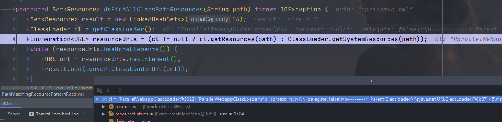

#### 1、spring MVC 集成文件上传功能后，启动失败，创建bean 失败

```java
org.springframework.beans.factory.BeanCreationException: Error creating bean with name 'multipartResolver': Lookup method resolution failed; nested exception is java.lang.IllegalStateException: Failed to introspect Class [org.springframework.web.multipart.commons.CommonsMultipartResolver] from ClassLoader [ParallelWebappClassLoader
  context: mvc
  delegate: false
```

[博文](https://blog.csdn.net/weixin_34411563/article/details/92375209) 

从错误提示中可以看出，是由于缺少相关的类文件的缘故。`MultipartResolver`用于处理文件上传，当收到请求时 `DispatcherServlet` 的 `checkMultipart()` 方法会调用 `MultipartResolver` 的 `isMultipart()` 方法判断请求中是否包含文件。如果请求数据中包含文件，则调用 `MultipartResolver` 的 `resolveMultipart()` 方法对请求的数据进行解析，然后将文件数据解析成 `MultipartFile` 并封装在 `MultipartHttpServletRequest` (继承了 `HttpServletRequest`) 对象中，最后传递给 `Controller`。`MultipartResolver`是一个接口，它的实现类有2个：

- CommonsMultipartResolver
- StandardServletMultipartResolver

其中 `CommonsMultipartResolver` 使用 *commons Fileupload* 来处理 `multipart` 请求，所以在使用spring的上传模块时，我们需要引入相应的 jar 包。不过`StandardServletMultipartResolver` 是基于 *Servlet 3.0*来处理 multipart请求的，所以不需要引用其他 jar 包，但是必须使用支持 Servlet 3.0的容器才可以（tomcat从 Tomcat 7.0以上的版本开始支持 Servlet 3.0）。由于此处我们使用的是`CommonsMultipartResolver`实现，因此需要引入相应的包，如下所示：

```xml
<dependency>
    <groupId>commons-fileupload</groupId>
    <artifactId>commons-fileupload</artifactId>
    <version>1.4</version>
</dependency>
<!--不需要引入下面这个了，上面得已经是依赖了这个-->
<dependency>
    <groupId>commons-io</groupId>
    <artifactId>commons-io</artifactId>
    <version>2.8.0</version>
</dependency>
```

引入后还是报错，找不到类，猜测是没有引用到。最后把jar包放大了tomcat的lib下面去试试。


解决问题，但是为什么放maven会引用不到，要放到lib下才行呢？

#### 2、启动正常，但是没有识别到 web.xml 中配置的 springmvc.xml 文件

报错信息：

```xml
IOException parsing XML document from ServletContext resource [/springmvc.xml]; nested exception is java.io.FileNotFoundException: Could not open ServletContext resource [/springmvc.xml]
```

spring 官网给出的配置是这样的：配置文件是 /WEB-INF/app-context.xml，默认在 WEB-INF 下寻找文件，我们要修改这里。

```xml
<web-app>

    <listener>
        <listener-class>org.springframework.web.context.ContextLoaderListener</listener-class>
    </listener>

    <context-param>
        <param-name>contextConfigLocation</param-name>
        <param-value>/WEB-INF/app-context.xml</param-value>
    </context-param>

    <servlet>
        <servlet-name>app</servlet-name>
        <servlet-class>org.springframework.web.servlet.DispatcherServlet</servlet-class>
        <init-param>
            <param-name>contextConfigLocation</param-name>
            <param-value></param-value>
        </init-param>
        <load-on-startup>1</load-on-startup>
    </servlet>

    <servlet-mapping>
        <servlet-name>app</servlet-name>
        <url-pattern>/app/*</url-pattern>
    </servlet-mapping>

</web-app>
```

但是修改了之后还是报着错误。。。debug源码之后，发现对路径的解析是在  loadBeanDefinitions 的时候进行了路径的统一包装，包装成了 Resource[]，数组。

```java
// org.springframework.beans.factory.support.AbstractBeanDefinitionReader#loadBeanDefinitions(java.lang.String, java.util.Set<org.springframework.core.io.Resource>)
public int loadBeanDefinitions(String location, @Nullable Set<Resource> actualResources) throws BeanDefinitionStoreException {
   ResourceLoader resourceLoader = getResourceLoader();
   if (resourceLoader == null) {
      throw new BeanDefinitionStoreException(
            "Cannot load bean definitions from location [" + location + "]: no ResourceLoader available");
   }

   if (resourceLoader instanceof ResourcePatternResolver) {
      // Resource pattern matching available.
      try {
         Resource[] resources = ((ResourcePatternResolver) resourceLoader).getResources(location);
         int count = loadBeanDefinitions(resources);
         if (actualResources != null) {
             ...
                
```

ServletContextResourcePatternResolver 类的 getResources(String locationPattern) 方法中，源码如下：

CLASSPATH_ALL_URL_PREFIX是 `String CLASSPATH_ALL_URL_PREFIX = "classpath*:";`但是，我们这里是不需要加 * 的。

```java
public Resource[] getResources(String locationPattern) throws IOException {
   Assert.notNull(locationPattern, "Location pattern must not be null");
   if (locationPattern.startsWith(CLASSPATH_ALL_URL_PREFIX)) {
      // a class path resource (multiple resources for same name possible)
      if (getPathMatcher().isPattern(locationPattern.substring(CLASSPATH_ALL_URL_PREFIX.length()))) {
         // a class path resource pattern
         return findPathMatchingResources(locationPattern);
      }
      else {
         // all class path resources with the given name，走的是这里
         return findAllClassPathResources(locationPattern.substring(CLASSPATH_ALL_URL_PREFIX.length()));
      }
   }
   else {
      // Generally only look for a pattern after a prefix here,
      // and on Tomcat only after the "*/" separator for its "war:" protocol.
      int prefixEnd = (locationPattern.startsWith("war:") ? locationPattern.indexOf("*/") + 1 :
            locationPattern.indexOf(':') + 1);
      if (getPathMatcher().isPattern(locationPattern.substring(prefixEnd))) {
         // a file pattern
         return findPathMatchingResources(locationPattern);
      }
      else {
         // a single resource with the given name
         return new Resource[] {getResourceLoader().getResource(locationPattern)};
      }
   }
}
```

随后调用了类加载器来加载这个路径的资源，类加载器如下图：


```java
ParallelWebappClassLoader
  context: mvc
  delegate: false
----------> Parent Classloader:
java.net.URLClassLoader@8b87145

```

`ParallelWebappClassLoader` 这个加载器是另一个spring boot 项目的内置 tomcat 的jar包里的。



最后找的却是这个路径下的 springmvc.xml 文件，离谱。`URL [file:/D:/projects/ownJavaDemo/target/javaThinkingDemo/WEB-INF/classes/springmvc.xml]` 项目是编译到 target 目录的。


最后因为当前默认的父工程的不知名原因，导致一直识别不到，因此，使用了相同的配置创建了一个新的module来运行，运行正常。


#### 使用spring的BeanFactoryPostProcessor实现对bean的属性做修改

在下面这个例子中就可以对bean的destroyMethodName做修改

```
@Slf4j
@Component
public class PulsarAndKafkaPostProcessor implements BeanFactoryPostProcessor {
    @Override
    public void postProcessBeanFactory(ConfigurableListableBeanFactory beanFactory) throws BeansException {
        String[] beanNames = beanFactory.getBeanNamesForType(PulsarClient.class);
        for (String beanName : beanNames) {
            BeanDefinition beanDefinition = beanFactory.getBeanDefinition(beanName);
            // 将 destroyMethodName 设置为空字符串
            beanDefinition.setDestroyMethodName("");
            log.info("Set destroyMethodName for PulsarClient: {}", beanName);
        }
    }
}
```

原理：

源码解释

```java
* Factory hook that allows for custom modification of an application context's
 * bean definitions, adapting the bean property values of the context's underlying
 * bean factory.
 *
 * <p>Useful for custom config files targeted at system administrators that
 * override bean properties configured in the application context. See
 * {@link PropertyResourceConfigurer} and its concrete implementations for
 * out-of-the-box solutions that address such configuration needs.
 *
 * <p>A {@code BeanFactoryPostProcessor} may interact with and modify bean
 * definitions, but never bean instances. Doing so may cause premature bean
 * instantiation, violating the container and causing unintended side-effects.
 * If bean instance interaction is required, consider implementing
 * {@link BeanPostProcessor} instead.
 * <h3>Registration</h3>
 * <p>An {@code ApplicationContext} auto-detects {@code BeanFactoryPostProcessor}
 * beans in its bean definitions and applies them before any other beans get created.
 * A {@code BeanFactoryPostProcessor} may also be registered programmatically
 * with a {@code ConfigurableApplicationContext}.
    
工厂挂钩，允许自定义修改应用程序上下文的bean定义，调整上下文的底层bean工厂的bean属性值。
对于针对系统管理员的自定义配置文件非常有用，这些配置文件覆盖在应用程序上下文中配置的bean属性。有关解决此类配置需求的开箱即用解决方案，请参阅propertyresourcecconfigururer及其具体实现。BeanFactoryPostProcessor可以与bean定义交互和修改，但不能与bean实例交互。这样做可能会导致过早的bean实例化，违反容器并导致意想不到的副作用。如果需要bean实例交互，请考虑实现BeanPostProcessor。
ApplicationContext在其bean定义中自动检测BeanFactoryPostProcessor bean，并在创建任何其他bean之前应用它们。BeanFactoryPostProcessor也可以通过编程方式注册到ConfigurableApplicationContext中。
```

https://blog.csdn.net/qq_42154259/article/details/108305938