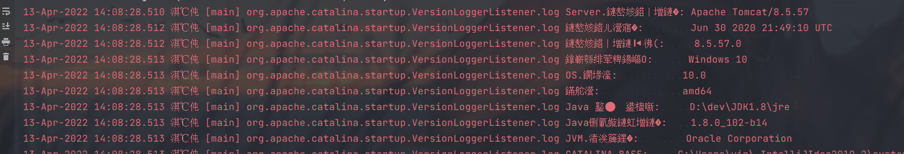
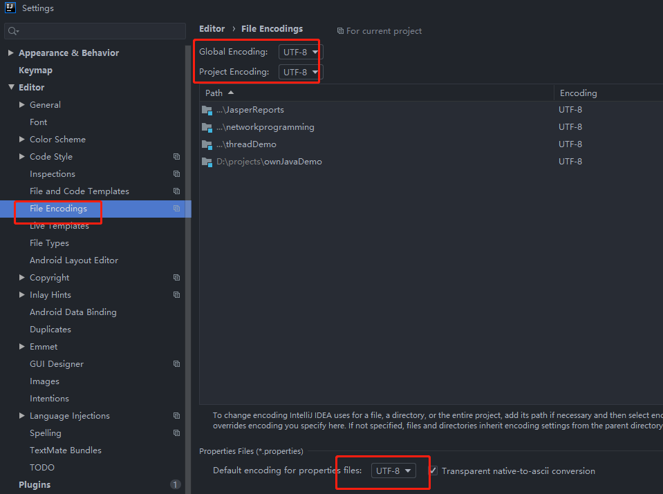
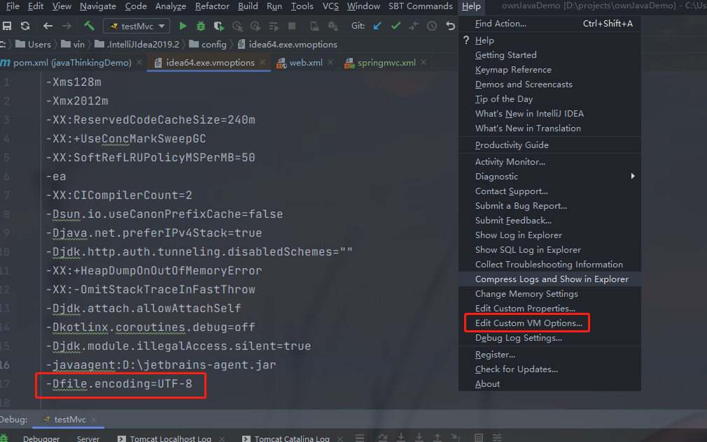
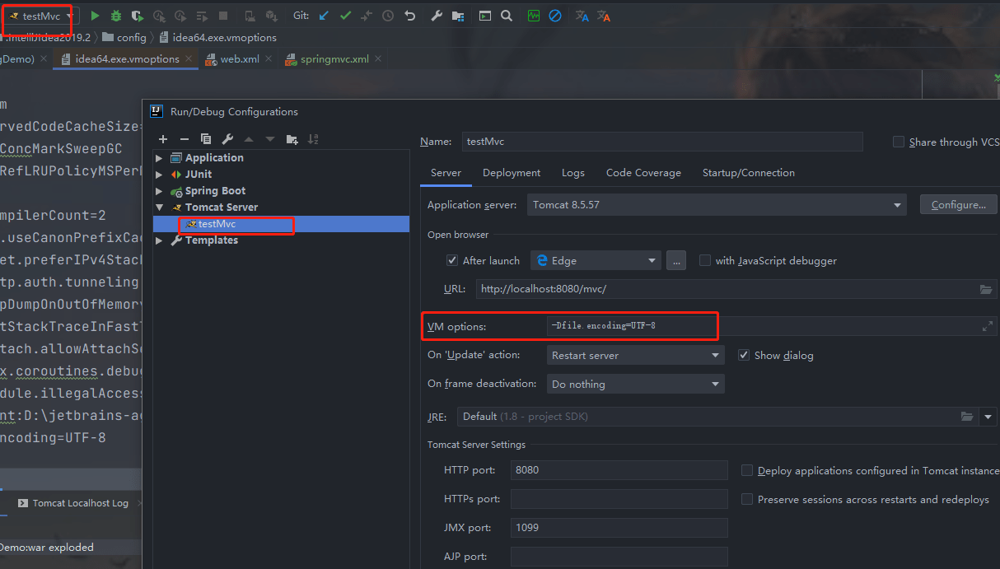

#### 1、修改tomcat默认编码方式 

不修改的话，如下图所示，编码出现问题：



默认情况下，tomcat使用的的编码方式：iso8859-1，修改tomcat下的conf/server.xml文件

```xml
<Connector port="8080" protocol="HTTP/1.1"
           connectionTimeout="20000"
           redirectPort="8443" />
```
可以在这里面添加一个属性：URIEncoding，将该属性值设置为UTF-8，即可让Tomcat（默认ISO-8859-1编码）以UTF-8的编码处理get请求。

但是上面是日志的编码出现错误，那要修改日志的配置文件，conf/logging.properties，

```tex
java.util.logging.ConsoleHandler.level = FINE
java.util.logging.ConsoleHandler.formatter = org.apache.juli.OneLineFormatter
java.util.logging.ConsoleHandler.encoding = UTF-8
```

发现默认的编码是 UTF-8，不需要进行修改，但是idea下输出却是乱码，继续查看idea控制台的编码格式。[参考](https://www.jianshu.com/p/7236d45cd1eb) 

[解决方案](https://blog.csdn.net/weixin_43883917/article/details/112064007) 

1 修改设置里面的文件编码



2 修改idea的参数



3 添加虚拟机参数到 tomcat 的配置里面



4 重启idea

#### 2、 tomcat 的 web.xml 没有识别到 resources 下的 spring-mvc 文件

方法1：pom 文件里面的打包方式是 pom，注释掉这个。

```java
<!--    识别不到 resources 下文件,把这打包方式注释掉 https://blog.csdn.net/weixin_43409994/article/details/118157694 -->
<!--    <packaging>pom</packaging>-->
```

注释掉之后编译到了文件。

方法2：可以在 pom 文件里面的builde节点下添加 resources 的节点

```xml
<resources>
    <resource>
        <directory>src/main/resources</directory>
        <!--<excludes>
            <exclude>**/*.properties</exclude>
            <exclude>**/*.xml</exclude>
        </excludes>-->
        <filtering>false</filtering>
    </resource>
    <resource>
        <directory>src/test/resources</directory>
        <!--<includes>
            <include>**/*.properties</include>
            <include>**/*.xml</include>
        </includes>-->
        <filtering>false</filtering>
    </resource>
</resources>
```

