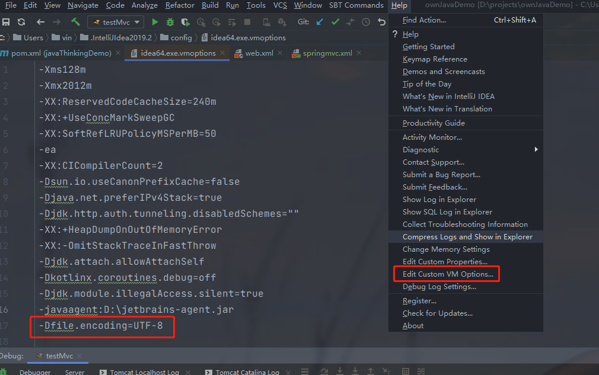

#### 1、修改tomcat默认编码方式 

不修改的话，如下图所示，编码出现问题：


默认情况下，tomcat使用的的编码方式：iso8859-1，修改tomcat下的conf/server.xml文件

```xml
<Connector port="8080" protocol="HTTP/1.1"
           connectionTimeout="20000"
           redirectPort="8443" />
```
可以在这里面添加一个属性：URIEncoding，将该属性值设置为UTF-8，即可让Tomcat（默认ISO-8859-1编码）以UTF-8的编码处理get请求。

但是上面是日志的编码出现错误，那要修改日志的配置文件，conf/logging.properties，

```tex
java.util.logging.ConsoleHandler.level = FINE
java.util.logging.ConsoleHandler.formatter = org.apache.juli.OneLineFormatter
java.util.logging.ConsoleHandler.encoding = UTF-8
```

发现默认的编码是 UTF-8，不需要进行修改，但是idea下输出却是乱码，继续查看idea控制台的编码格式。[参考](https://www.jianshu.com/p/7236d45cd1eb) 

[解决方案](https://blog.csdn.net/weixin_43883917/article/details/112064007) 

1 修改设置里面的文件编码


2 修改idea的参数



3 添加虚拟机参数到 tomcat 的配置里面


修改idea的console输出编码 》 [解决IntelliJ IDEA中tomcat控制台中文乱码问题](https://blog.csdn.net/mr_liuhailong/article/details/110264765)


4 重启idea

###### Tomcat 配置

对 Tomcat 启动脚本 `catalina.bat` 中的环境变量 `JAVA_OPTIONS` 追加如下参数；-Dfile.encoding=UTF-8

```properties
rem Register custom URL handlers
rem Do this here so custom URL handles (specifically 'war:...') can be used in the security policy
set "JAVA_OPTS=%JAVA_OPTS% -Djava.protocol.handler.pkgs=org.apache.catalina.webresources -Dfile.encoding=UTF-8"
```


[IntelliJ IDEA 中 Tomcat 控制台乱码解决方法](https://cloud.tencent.com/developer/article/2023344)

#### 2、 tomcat 的 web.xml 没有识别到 resources 下的 spring-mvc 文件

方法1：pom 文件里面的打包方式是 pom，注释掉这个。当选择了打包方式为pom时，意味着该工程是个聚合工程，而这个工程也就是个父工程，只用来做依赖版本管理和模块管理，并不会涉及到源码，所以maven不会将resources下的文件编译到classes路径下。所以将打包方式换成jar，编译成功！

```java
<!--    识别不到 resources 下文件,把这打包方式注释掉 https://blog.csdn.net/weixin_43409994/article/details/118157694 -->
<!--    <packaging>pom</packaging>-->
```

注释掉之后编译到了文件。

方法2：可以在 pom 文件里面的builde节点下添加 resources 的节点

```xml
<resources>
    <resource>
        <directory>src/main/resources</directory>
        <!--<excludes>
            <exclude>**/*.properties</exclude>
            <exclude>**/*.xml</exclude>
        </excludes>-->
        <filtering>false</filtering>
    </resource>
    <resource>
        <directory>src/test/resources</directory>
        <!--<includes>
            <include>**/*.properties</include>
            <include>**/*.xml</include>
        </includes>-->
        <filtering>false</filtering>
    </resource>
</resources>
```

#### 3 org.apache.catalina.core.StandardContext.startInternal 一个或多个listeners启动失败，报错

```java
31-Jan-2024 13:55:59.240 严重 [RMI TCP Connection(5)-127.0.0.1] org.apache.catalina.core.StandardContext.startInternal 一个或多个listeners启动失败，更多详细信息查看对应的容器日志文件
31-Jan-2024 13:55:59.242 严重 [RMI TCP Connection(5)-127.0.0.1] org.apache.catalina.core.StandardContext.startInternal 由于之前的错误，Context[/mvctest_war_exploded]启动失败
[2024-01-31 01:55:59,302] Artifact mvctest:war exploded: Error during artifact deployment. See server log for details.
```

参考解决方案：https://www.cnblogs.com/10134dz/p/14749735.html。这个报错还可能是因为上面 pom 的打包方式错了。

#### 4 idea 的tomcat 的 tomcat localhost log 乱码

要去到tomcat 的conf文件下，配置对应log的编码

#### IDEA 控制台、Tomcat Log 乱码终极解决方案(乱码一定能解决!!!)

https://blog.csdn.net/qq_31588719/article/details/102516823

```tex
31-Jan-2024 14:22:52.516 淇℃伅 [RMI TCP Connection(3)-127.0.0.1] org.apache.catalina.core.ApplicationContext.log Initializing Spring DispatcherServlet 'dispatcher'
31-Jan-2024 14:22:52.517 涓ラ噸 [RMI TCP Connection(3)-127.0.0.1] org.apache.catalina.core.ApplicationContext.log StandardWrapper.Throwable
	org.springframework.beans.factory.BeanDefinitionStoreException: IOException parsing XML document from ServletContext resource [/springmvc.xml]; nested exception is java.io.FileNotFoundException: Could not open ServletContext resource [/springmvc.xml]
		at org.springframework.beans.factory.xml.XmlBeanDefinitionReader.loadBeanDefinitions(XmlBeanDefinitionReader.java:342)
```


我本来是这三个都乱码，然后第一个修改了idea的console输出编码。

第二个是修改了 logging.properties 文件里的 

2localhost.org.apache.juli.AsyncFileHandler.level = FINE
2localhost.org.apache.juli.AsyncFileHandler.directory = ${catalina.base}/logs
2localhost.org.apache.juli.AsyncFileHandler.prefix = localhost.
2localhost.org.apache.juli.AsyncFileHandler.encoding = GBK

第三个是修改了

1catalina.org.apache.juli.AsyncFileHandler.level = FINE
1catalina.org.apache.juli.AsyncFileHandler.directory = ${catalina.base}/logs
1catalina.org.apache.juli.AsyncFileHandler.prefix = catalina.
1catalina.org.apache.juli.AsyncFileHandler.encoding = GBK

猜测这些不同的日志是对应的。

