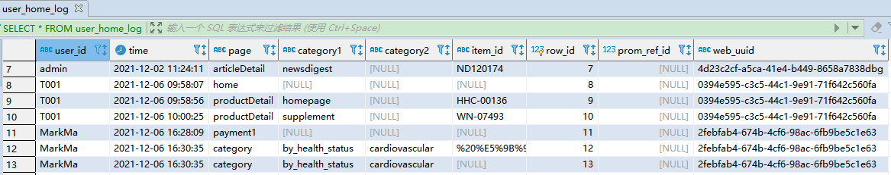

对于当前有一个需求是这样的：

1. 新建表user_uuid_map，字段：user_id varchar(50)，web_uuid varchar(200)，2个字段都作主键。
2. 对于当前user_home_log存量数据，给其中每个user id按当前web uuid逻辑生成新的uuid(生成时间统一用2022-11-02 00：00：00)。并且生成的数据对应user id存入user_uuid_map表。
3. user_home_log表增加字段prom_ref_id int(11)，web_uuid varchar(200)。去除字段user id(注意：去除前需先根据user id到user_uuid_map查找 uuid更新到新增加的web_uuid 字段，更新所有记录后再去除user id字段)。

```mysql
CREATE TABLE `user_uuid_map` (
  `user_id` varchar(50) COLLATE utf8mb4_bin NOT NULL,
  `web_uuid` varchar(200) COLLATE utf8mb4_bin NOT NULL,
  PRIMARY KEY (`user_id`,`web_uuid`)
) ENGINE=InnoDB DEFAULT CHARSET=utf8mb4 COLLATE=utf8mb4_bin

CREATE TABLE `user_home_log` (
  `user_id` varchar(50) COLLATE utf8mb4_bin DEFAULT NULL,
  `time` datetime NOT NULL,
  `page` varchar(50) COLLATE utf8mb4_bin DEFAULT NULL,
  `category1` varchar(50) COLLATE utf8mb4_bin DEFAULT NULL,
  `category2` varchar(50) COLLATE utf8mb4_bin DEFAULT NULL,
  `item_id` varchar(50) COLLATE utf8mb4_bin DEFAULT NULL,
  `row_id` int(11) NOT NULL AUTO_INCREMENT,
  `prom_ref_id` int(11) DEFAULT NULL,
  `web_uuid` varchar(200) COLLATE utf8mb4_bin DEFAULT NULL,
  PRIMARY KEY (`row_id`)
) ENGINE=InnoDB AUTO_INCREMENT=19575 DEFAULT CHARSET=utf8mb4 COLLATE=utf8mb4_bin

```

user_home_log 的数据是记录了用户访问了哪个页面：


现在要针对每个user_id 生成一个 uuid，生成的 uuid 的规则则是前端定义好的规则，所以需要将规则转为 MySQL 生成，所以就需要定义一个函数：

```mysql
/*删除 generateUuid */ 
DROP FUNCTION IF EXISTS generateUuid;
-- 这步操作一定要做，不然会执行不了，注意函数定义的每个语句后面都需要分号结尾，不然会报错，一定要记住，我就因为这个弄好久。declare 需要在 set 前定义比较好。
/**
 * 1 DROP FUNCTION IF EXISTS generateUuid; 先删除
 * 2 DELIMITER //
 * 3 执行时，选中create 到 end
 * 4 再执行 DELIMITER ;
 */
/* 1 删除函数 generateUuid */
DROP FUNCTION IF EXISTS generateUuid;
/* 2 设置结束符为 // */
DELIMITER //
/* 3 创建 uuid 函数 */
CREATE FUNCTION generateUuid(str varchar(100), timeValue varchar(100))
  RETURNS varchar(3000) DETERMINISTIC
  BEGIN
	DECLARE uuid varchar(3000) DEFAULT '';
	DECLARE i int;
	DECLARE d int;
	SET d = unix_timestamp(timeValue);
 	set @str = str;
 	SET @len = char_length(@str);
 	SET i = 1;
 	WHILE (i <= @len) DO
 		SET @r = (rand() * 16 + d) % 16 | 0;
 		SET d = floor(d / 16);
 		SET @curS = substring(@str, i, 1);
 		SET @needConvert = '';
 		IF @curS = 'x' THEN
 			SET @needConvert = @r;
 			SET uuid = concat(uuid, lower(conv(@needConvert, 10, 36)));
 		ELSEIF @curS = 'y' THEN
 			SET @needConvert = @r & 0x3 | 0x8;
 			SET uuid = concat(uuid, lower(conv(@needConvert, 10, 36)));
 		ELSE
 			SET @needConvert = concat(@needConvert, @curS);
 			SET uuid = concat(uuid, @needConvert);
 		END IF;
 		SET i = i + 1;
 	END WHILE;
 	RETURN uuid;
  END
//
/* 4 设置结束符为 ; */
DELIMITER ;

-- 执行调用则是 
SELECT generateUuid('xxxxxxxx-xxxx-4xxx-yxxx-xxxxxxxxxxxx','2022-11-02 00:00:00');
SELECT lower(hex(10));
SELECT conv("7", 10, 36);
SELECT (rand() * 16 + 1000) % 16 | 0;
SELECT substring('xxxxxxxx-xxxx-4xxx-yxxx-xxxxxxxxxxxx', 1,1); 
```

在定义一个存储过程，使用游标进行操作：可以参考博客： https://www.jianshu.com/p/9a0b4c00f491 

```mysql
/**
 * 1 DROP FUNCTION IF EXISTS addUserUuidMapProcedure; 先删除
 * 2 DELIMITER //
 * 3 执行时，选中create 到 end
 * 4 再执行 DELIMITER ;
 * 5 调用 CALL addUserUuidMapProcedure();
 */
/* 1 如果存储过程存在则删除*/ 
DROP PROCEDURE IF EXISTS addUserUuidMapProcedure;
/* 2 设置结束符为 // */ 
DELIMITER // 
/* 3 创建存储过程 addUserUuidMapProcedure */ 
CREATE PROCEDURE addUserUuidMapProcedure()
	BEGIN
		DECLARE user_id_value varchar(50);
		DECLARE flag int DEFAULT 0;
		# 申明一个游标来记录 sql 的查询结果
		DECLARE user_id_list CURSOR FOR SELECT user_id FROM user_home_log GROUP BY user_id ;
		# 建立一个循环退出标志，当游标遍历完后将flag的值设置为1
		DECLARE CONTINUE handler FOR NOT FOUND SET flag = 1;
		# 打开游标
		OPEN user_id_list;
			# 将游标中的值赋给定义好的变量，实现循环
			FETCH user_id_list INTO user_id_value;
			WHILE flag <> 1 do 
				# 获取uuid
				SET @uuid = '';
				SELECT generateUuid('xxxxxxxx-xxxx-4xxx-yxxx-xxxxxxxxxxxx','2022-11-02 00:00:00') INTO @uuid ;
				# 插入一条数据
				INSERT INTO user_uuid_map (`user_id`, `web_uuid`) VALUES (user_id_value, @uuid);
				# 游标往后移
				FETCH user_id_list INTO user_id_value;
			END WHILE ;
		CLOSE user_id_list;
	END //
/* 4 将结束符置为;*/ 
DELIMITER ;
/* 5 调用 */
CALL addUserUuidMapProcedure();
-- 查询结果
SELECT * FROM user_uuid_map ;
user_id   |web_uuid                            |
----------|------------------------------------|
20220506  |32ad8cbd-281f-4298-a6b3-fg2c69c37db1|
20220507  |4995274a-866d-47e0-b809-cb2c3ace2f6f|
20220508  |9aed801b-e91c-4f78-8bb5-d7c7e35e784d|
20220509  |5b16g955-7dc4-4159-8e66-a9f16b6cb407|
20220510  |04g49e41-f2d9-4fg3-acc9-0713bcb6a299|
KenixChu  |4e52eca8-7eg5-4e81-98f1-24d7dad4bdda|
MarkMa    |da5e8dg1-142e-467f-ab2c-2c5865b45e8d|
Pat1      |75ea9e43-7e1b-4687-806d-9c0e77df334a|
T001      |7d69fb5g-8a8c-4cf9-b2g9-d6577b2bfa49|
admin     |gc867177-56f8-47ag-aa5d-77b2c3ebd1e1|
andyzhong |d73c93b9-g6df-4919-b63f-c573c269bdf5|
diko003   |b226c5ef-809d-4f9e-9057-3087aggge8f2|
grace01   |fa1a2621-d79a-4e50-bg9e-9d67gcc7f77f|
grace03   |3cb6e3d1-4320-4933-956f-f17252ae7b27|
grace04   |d5bdf3b8-742b-4bb5-acgb-e936445gfa61|
grace67   |1d56gb1d-ce34-41b3-ae24-9d53f59f171e|
grace68   |57c9d582-63be-448d-ad66-1c70df73a8bf|
...
```

最后则再通过存储过程实现表的数据的更新

```mysql
/**
 * 1 DROP FUNCTION IF EXISTS updateUseHomeUuidProcedure; 先删除
 * 2 DELIMITER //
 * 3 执行时，选中create 到 end
 * 4 再执行 DELIMITER ;
 * 5 调用 CALL updateUseHomeUuidProcedure();
 */
/* 1 如果存储过程存在则删除*/ 
DROP PROCEDURE IF EXISTS updateUseHomeUuidProcedure;
/* 2 设置结束符为 // */ 
DELIMITER // 
/* 3 创建存储过程 addUserUuidMapProcedure */ 
CREATE PROCEDURE updateUseHomeUuidProcedure()
	BEGIN
		DECLARE user_id_value varchar(50);
		DECLARE uuid_id_value varchar(50);
		DECLARE flag int DEFAULT 0;
		# 申明一个游标来记录 sql 的查询结果
		DECLARE user_uuid_map_list CURSOR FOR SELECT user_id, web_uuid FROM user_uuid_map;
		# 建立一个循环退出标志，当游标遍历完后将flag的值设置为1
		DECLARE CONTINUE handler FOR NOT FOUND SET flag = 1;
		# 打开游标
		OPEN user_uuid_map_list;
			# 将游标中的值赋给定义好的变量，实现循环
			FETCH user_uuid_map_list INTO user_id_value, uuid_id_value;
			WHILE flag <> 1 do 
				# 更新 user_home_log
				UPDATE user_home_log SET web_uuid = uuid_id_value WHERE user_id = user_id_value;
				# 游标往后移
				FETCH user_uuid_map_list INTO user_id_value, uuid_id_value;
			END WHILE ;
		CLOSE user_uuid_map_list;
	END //
/* 4 将结束符置为;*/ 
DELIMITER ;
/* 5 调用 */
CALL updateUseHomeUuidProcedure();

SELECT * FROM user_home_log;

```



