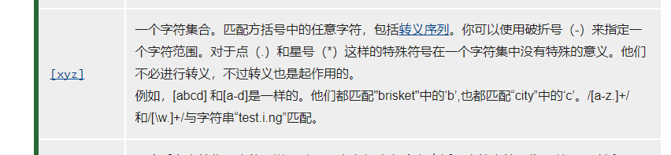

#### 前端相关问题  

#### 一、跨域请求（跨域资源共享：“`CORS`,Cross-origin resource sharing”）  

参考：http://www.ruanyifeng.com/blog/2016/04/CORS.html  

它允许浏览器向**跨源服务器，发出`XMLHttpRequest`[链接](http://www.ruanyifeng.com/blog/2012/09/xmlhttprequest_level_2.html)请求**，从而克服了AJAX只能同源是用的限制。  

##### 1 简介

`CORS`需要浏览器和服务器同时支持。目前，所有浏览器都支持该功能，IE浏览器不能低于IE10。整个`CORS`通信过程都是浏览器自动完成，不需要用户参与。对于开发者来说，`CORS`通信与同源的AJAX通信没有差别，代码完全一样。浏览器一旦发现AJAX请求跨源，就会自动添加一些附加的头信息，有时还会多出一次附加的请求，单用户不会有感觉。因此，实现`CORS`通信的关键是服务器。只要服务器实现了`CORS`接口，就可以跨源通信。  

##### 2 两种请求  

浏览器将`CORS`请求分成两类：简单请求（simple request）和非简单请求（not-so-simple request）。  

简单请求同时满足以下2个条件 ，否则就是非简单请求。

```javascript
（1）请求方法是是以下三种方法之一：
1. HEAD
2. GET
3. POST
（2）HTTP的头信息不超出以下几种字段：
Accept
Accept-Language
Content-Language
Last-Event-ID
Content-Type：只限于三个值application/x-www-form-urlencoded、multipart/form-data、text/plain
```

这是为了兼容表单（form），因为历史上表单一直可以发出跨域请求。AJAX 的跨域设计就是，只要表单可以发，AJAX 就可以直接发。浏览器对于这两种请求处理是不一样的。  

##### 3 简单请求

###### 3.1 基本流程  

对于简单请求，浏览器直接发出`CORS`请求。具体来说，就是在头信息之中，增加一个`Origin`字段。

下面是一个例子，浏览器发现这次跨源AJAX请求是简单请求，就自动在头信息之中，添加一个`Origin`字段。

> ```http
> GET /`CORS` HTTP/1.1
> Origin: http://api.bob.com
> Host: api.alice.com
> Accept-Language: en-US
> Connection: keep-alive
> User-Agent: Mozilla/5.0...
> ```

上面的头信息中，`Origin`字段用来说明，本次请求来自哪个源（协议 + 域名 + 端口）。服务器根据这个值，决定是否同意这次请求。

如果`Origin`指定的源，不在许可范围内，服务器会返回一个正常的HTTP回应。浏览器发现，这个回应的头信息没有包含`Access-Control-Allow-Origin`字段（详见下文），就知道出错了，从而抛出一个错误，被`XMLHttpRequest`的`onerror`回调函数捕获。注意，这种错误无法通过状态码识别，因为HTTP回应的状态码有可能是200。

如果`Origin`指定的域名在许可范围内，服务器返回的响应，会多出几个头信息字段。

> ```http
> Access-Control-Allow-Origin: http://api.bob.com
> Access-Control-Allow-Credentials: true
> Access-Control-Expose-Headers: FooBar
> Content-Type: text/html; charset=utf-8
> ```

上面的头信息之中，有三个与`CORS`请求相关的字段，都以`Access-Control-`开头。

**（1）Access-Control-Allow-Origin**

该字段是必须的。它的值要么是请求时`Origin`字段的值，要么是一个`*`，表示接受任意域名的请求。

**（2）Access-Control-Allow-Credentials**

该字段可选。它的值是一个布尔值，表示是否允许发送Cookie。默认情况下，Cookie不包括在`CORS`请求之中。设为`true`，即表示服务器明确许可，Cookie可以包含在请求中，一起发给服务器。这个值也只能设为`true`，如果服务器不要浏览器发送Cookie，删除该字段即可。

**（3）Access-Control-Expose-Headers**

该字段可选。`CORS`请求时，`XMLHttpRequest`对象的`getResponseHeader()`方法只能拿到6个基本字段：`Cache-Control`、`Content-Language`、`Content-Type`、`Expires`、`Last-Modified`、`Pragma`。如果想拿到其他字段，就必须在`Access-Control-Expose-Headers`里面指定。上面的例子指定，`getResponseHeader('FooBar')`可以返回`FooBar`字段的值。

###### 3.2 withCredentials 属性  

上面说到，`CORS`请求默认不发送Cookie和HTTP认证信息。如果要把Cookie发到服务器，一方面要服务器同意，指定`Access-Control-Allow-Credentials`字段。

> ```http
> Access-Control-Allow-Credentials: true
> ```

另一方面，开发者必须在AJAX请求中打开`withCredentials`属性。

> ```javascript
> var xhr = new XMLHttpRequest();
> xhr.withCredentials = true;
> ```

否则，即使服务器同意发送Cookie，浏览器也不会发送。或者，服务器要求设置Cookie，浏览器也不会处理。  但是，如果省略`withCredentials`设置，有的浏览器还是会一起发送Cookie。这时，可以显式关闭`withCredentials`。

> ```javascript
> xhr.withCredentials = false;
> ```

需要注意的是，如果要发送Cookie，`Access-Control-Allow-Origin`就不能设为星号，必须指定明确的、与请求网页一致的域名。同时，Cookie依然遵循同源政策，只有用服务器域名设置的Cookie才会上传，其他域名的Cookie并不会上传，且（跨源）原网页代码中的`document.cookie`也无法读取服务器域名下的Cookie。

##### 4 非简单请求

###### 4.1 预检请求

非简单请求是那种对服务器有特殊要求的请求，比如请求方法是`PUT`或`DELETE`，或者`Content-Type`字段的类型是`application/json`。

非简单请求的`CORS`请求，会在正式通信之前，增加一次HTTP查询请求，称为"预检"请求（preflight）。

浏览器先询问服务器，当前网页所在的域名是否在服务器的许可名单之中，以及可以使用哪些HTTP动词和头信息字段。只有得到肯定答复，浏览器才会发出正式的`XMLHttpRequest`请求，否则就报错。

下面是一段浏览器的JavaScript脚本。

> ```javascript
> var url = 'http://api.alice.com/`CORS`';
> var xhr = new XMLHttpRequest();
> xhr.open('PUT', url, true);
> xhr.setRequestHeader('X-Custom-Header', 'value');
> xhr.send();
> ```

上面代码中，HTTP请求的方法是`PUT`，并且发送一个自定义头信息`X-Custom-Header`。

浏览器发现，这是一个非简单请求，就自动发出一个"预检"请求，要求服务器确认可以这样请求。下面是这个"预检"请求的HTTP头信息。

> ```http
> OPTIONS /`CORS` HTTP/1.1
> Origin: http://api.bob.com
> Access-Control-Request-Method: PUT
> Access-Control-Request-Headers: X-Custom-Header
> Host: api.alice.com
> Accept-Language: en-US
> Connection: keep-alive
> User-Agent: Mozilla/5.0...
> ```

"预检"请求用的请求方法是`OPTIONS`，表示这个请求是用来询问的。头信息里面，关键字段是`Origin`，表示请求来自哪个源。

除了`Origin`字段，"预检"请求的头信息包括两个特殊字段。

**（1）Access-Control-Request-Method**

该字段是必须的，用来列出浏览器的`CORS`请求会用到哪些HTTP方法，上例是`PUT`。

**（2）Access-Control-Request-Headers**

该字段是一个逗号分隔的字符串，指定浏览器`CORS`请求会额外发送的头信息字段，上例是`X-Custom-Header`。

###### 4.2 预检请求的回应

服务器收到"预检"请求以后，检查了`Origin`、`Access-Control-Request-Method`和`Access-Control-Request-Headers`字段以后，确认允许跨源请求，就可以做出回应。

> ```http
> HTTP/1.1 200 OK
> Date: Mon, 01 Dec 2008 01:15:39 GMT
> Server: Apache/2.0.61 (Unix)
> Access-Control-Allow-Origin: http://api.bob.com
> Access-Control-Allow-Methods: GET, POST, PUT
> Access-Control-Allow-Headers: X-Custom-Header
> Content-Type: text/html; charset=utf-8
> Content-Encoding: gzip
> Content-Length: 0
> Keep-Alive: timeout=2, max=100
> Connection: Keep-Alive
> Content-Type: text/plain
> ```

上面的HTTP回应中，关键的是`Access-Control-Allow-Origin`字段，表示`http://api.bob.com`可以请求数据。该字段也可以设为星号，表示同意任意跨源请求。

> ```javasc
> Access-Control-Allow-Origin: *
> ```

如果服务器否定了"预检"请求，会返回一个正常的HTTP回应，但是没有任何`CORS`相关的头信息字段。这时，浏览器就会认定，服务器不同意预检请求，因此触发一个错误，被`XMLHttpRequest`对象的`onerror`回调函数捕获。控制台会打印出如下的报错信息。

> ```http
> XMLHttpRequest cannot load http://api.alice.com.
> Origin http://api.bob.com is not allowed by Access-Control-Allow-Origin.
> ```

服务器回应的其他`CORS`相关字段如下。

> ```http
> Access-Control-Allow-Methods: GET, POST, PUT
> Access-Control-Allow-Headers: X-Custom-Header
> Access-Control-Allow-Credentials: true
> Access-Control-Max-Age: 1728000
> ```

**（1）Access-Control-Allow-Methods**

该字段必需，它的值是逗号分隔的一个字符串，表明服务器支持的所有跨域请求的方法。注意，返回的是所有支持的方法，而不单是浏览器请求的那个方法。这是为了避免多次"预检"请求。

**（2）Access-Control-Allow-Headers**

如果浏览器请求包括`Access-Control-Request-Headers`字段，则`Access-Control-Allow-Headers`字段是必需的。它也是一个逗号分隔的字符串，表明服务器支持的所有头信息字段，不限于浏览器在"预检"中请求的字段。

**（3）Access-Control-Allow-Credentials**

该字段与简单请求时的含义相同。

**（4）Access-Control-Max-Age**

该字段可选，用来指定本次预检请求的有效期，单位为秒。上面结果中，有效期是20天（1728000秒），即允许缓存该条回应1728000秒（即20天），在此期间，不用发出另一条预检请求。

###### 4.3 浏览器的正常请求和回应

一旦服务器通过了"预检"请求，以后每次浏览器正常的`CORS`请求，就都跟简单请求一样，会有一个`Origin`头信息字段。服务器的回应，也都会有一个`Access-Control-Allow-Origin`头信息字段。

下面是"预检"请求之后，浏览器的正常`CORS`请求。

> ```http
> PUT /`CORS` HTTP/1.1
> Origin: http://api.bob.com
> Host: api.alice.com
> X-Custom-Header: value
> Accept-Language: en-US
> Connection: keep-alive
> User-Agent: Mozilla/5.0...
> ```

上面头信息的`Origin`字段是浏览器自动添加的。

下面是服务器正常的回应。

> ```http
> Access-Control-Allow-Origin: http://api.bob.com
> Content-Type: text/html; charset=utf-8
> ```

上面头信息中，`Access-Control-Allow-Origin`字段是每次回应都必定包含的。

##### 5 与JSONP的比较  

`CORS`与JSONP的使用目的相同，但是比JSONP更强大。

JSONP只支持`GET`请求，`CORS`支持所有类型的HTTP请求。JSONP的优势在于支持老式浏览器，以及可以向不支持`CORS`的网站请求数据。

#### 二、angularjs相关

##### 1. 跳转前端跳转页面附带参数到另一个页面。

可以先学习下JavaScript中的浏览器的[location](https://www.runoob.com/js/js-window-location.html)对象，参考：https://developer.mozilla.org/zh-CN/docs/Web/API/Window/location

要跳转的页面的js：  

```javascript
$(location).attr('href', getBaseURL() + '/i/home#!/link/searchArticle?searchwords='+$scope.searchWords);
```

跳转到的目的地页面：

```javascript
// 解释下$location的作用 
/**
* $location服务解析浏览器地址中的url（基于window.location）并且使url在应用程序中可用。将地址栏中的网址的变化反映到$location服务和$location的变化反映到浏览器地址栏 https://www.angularjs.net.cn/api/113.html
**/
$scope.searchParameters = $location.search()
    , searchKey = $scope.searchParameters['searchwords'];
console.log ("searchKey " + searchKey);
```

##### **2. AngularJS的filter使用**    


##### 3. AngularJS的初始化流程  

参考：https://www.cnblogs.com/sxz2008/p/6367943.html

1、浏览器载入HTML，然后把它解析成DOM。
2、浏览器载入angular.js脚本。
3、AngularJS等到DOMContentLoaded事件触发。
4、AngularJS寻找ng-app指令，这个指令指示了应用的边界。
5、使用ng-app中指定的模块来配置注入器($injector)。
6、注入器($injector)是用来创建“编译服务($compile service)”和“根作用域($rootScope)”的。
7、编译服务($compile service)是用来编译DOM并把它链接到根作用域($rootScope)的。
8、ng-init指令将“World”赋给作用域里的name这个变量。
9、通过{{name}}的替换，整个表达式变成了“Hello World”。

##### 4. AngularJs的angular-translate第三方插件的使用  

（1）`instant(translationId, interpolateParams, interpolationId, forceLanguage, sanitizeStrategy)`方法的使用。  

可以参考：[angularjs国际化多语言，angular-translate教程详解，$translate.instant()为什么不生效 - 听风是风 - 博客园](https://www.cnblogs.com/echolun/p/12762839.html) ， [官方网站](https://angular-translate.github.io/docs/#/api/pascalprecht.translate.$translate),以及[方法的源代码 ](https://github.com/angular-translate/angular-translate/blob/d727abb/src/service/translate.js#L2169)。  

代码示例：  

```javascript
instant(translationId, interpolateParams, interpolationId, forceLanguage, sanitizeStrategy)

$scope.getActionDesc = function(action, type) {
        var $$key = '',action1 = '',action2 = '';
        if(action && action.indexOf("|") != -1 && (action = action.split("|"))) {
            action1 = action[0]; action2 = action[1];
        }
        if (INVENTORTY_ACTION_RECV == action) {
            $$key = 'salesCommon.invActionRecv';
        } else if (INVENTORTY_ACTION_SELL == action) {
            $$key = 'salesCommon.invActionSell';
        } else if ((action1 && action2) && (INVENTORTY_ACTION_ADD == action1 && INVENTORTY_ACTION_ADDS == action2)) {
            $$key = 'salesCommon.invActionAdd';
        } else if (INVENTORTY_ACTION_RTN == action) {
            $$key = 'salesCommon.invActionRtn';
        } else if ((action1 && action2) && (INVENTORTY_ACTION_RDC == action1 && INVENTORTY_ACTION_RDCS == action2)) {
            $$key = 'salesCommon.invActionRdc';
        } else if (INVENTORTY_ACTION_SCRP == action) {
            $$key = 'salesCommon.invActionScrp';
        } else if (INVENTORTY_ACTION_CHD == action) {
            $$key = 'salesCommon.invActionChD';
        } else if (INVENTORTY_ACTION_TRS == action) {
            $$key = 'salesCommon.invActionTRS';
        }
        if(type === 1) return $translate.instant($$key, {}, undefined, "en");
        return $translate.instant($$key);
    }
```

##### 5. 事件监听

（1）angular js禁止输入数字字符或者其他输入 https://www.cnblogs.com/siweipancc/p/angulr_forbid_values_with_directive.html 

（2）输入框事件监听顺序，keydown,keypress,keyup https://blog.csdn.net/yiifaa/article/details/52372022 

##### 6 后退到主页面的时候刷新主页面   

根据location的hash值，来确定后退的页面是不是主页面了，是的话，重新加载页面。当点击主页面的图片连接的时候，直接对href进行更改，这个时候不会触发页面的历史记录发生变化。

```javascript
$("#TopLogo, #FooterLogo").on("mousedown", function () {
    window.location.href = "/#!/link/home"; // 主页面的连接地址
});    
if (window.history && window.history.pushState) {
        window.onpopstate = function(event) {
            // console.info("location: " + document.location + ", state: " + JSON.stringify(event.state));
            if(document.location.hash == "#!/link/home") {
                window.location.reload();
            }
        };
    }
```


#### 三、其他 

##### 1、input输入框实时检索  

需要观察到用户每次键盘输入的变化，必须要使用keydown、keyup与input，onchange与blur无效，在这其中，keyup和input都能及时获取到用户输入的全职，而keydown不会将当前的值计入到输入框中的值中。参考：[博客](https://blog.csdn.net/yiifaa/article/details/52372022)。  

方法：使用input & propertychange 事件，参考：[input propertychange 监听输入框](https://blog.csdn.net/tangxiaolang101/article/details/54863821)    

- input 是标准的浏览器事件，一般用于input元素，当input的value值发生变化就会出发，无论是键盘输入还是鼠标粘贴的改变都能及时监听到变化。  
- propertychange只要当前对象属性发生改变就会触发。

目前input & propertychange仍然是即时搜索比较好的解决方案。参考MDN[文档](https://developer.mozilla.org/zh-CN/docs/Web/API/HTMLElement/input_event)，当一个 [`input`](https://developer.mozilla.org/zh-CN/docs/Web/HTML/Element/Input), [`select`](https://developer.mozilla.org/zh-CN/docs/Web/HTML/Element/select), 或 [`textarea`](https://developer.mozilla.org/zh-CN/docs/Web/HTML/Element/textarea) 元素的 `value` 被修改时，会触发 **`input`** 事件。  

##### 2、对数字进行和小数进行检查  

```javascript
regStrs:
(5) [Array(2), Array(2), Array(2), Array(2), Array(2)]
0: (2) ["[^\d\.]", ""]
1: (2) ["^\.(\d+)$", "0.$1"]
2: (2) ["^0(\d+)$", "$1"]
3: (2) ["\.(\d?)\.+", ".$1"]
4: (2) ["^(\d+\.\d{2}).+", "$1"]
length: 5
// 使用
<input type="text" id="origin" limit-decimal="10,2" placeholder="" class="form-control" ng-model="product.listPrice" />
// 指令
.directive('limitDecimal', ['$parse', '$timeout', function($parse, $timeout) {
    return {
        restrict: 'A',
        require: 'ngModel',
        scope: {
            maxValue: '@',
            minValue: '@?',
            maxDecimal: '@'
        },
        link: function link($scope, $element, $attr, ngModel) {
            var $model = $parse($attr.ngModel);
            var $decimal = $attr.limitDecimal;
            var $maxDecimal = 0;
            var $maxInt = 0;
            if (angular.isDefined($decimal)) {
                var $decimalArr = $decimal.split(',');
                if (angular.isDefined($decimalArr[0]) && $decimalArr[0] != '') {
                    $maxInt = parseInt($decimalArr[0]);
                }
                if ($decimalArr.length > 1 && angular.isDefined($decimalArr[1]) && $decimalArr[1] != '') {
                    $maxDecimal = parseInt($decimalArr[1]);
                }
            }
            var $regStrs = [['[^\\d\\.]', '']];  // 多谢了一个\进行了转义，但是也是同样起作用的
            // 实际就是 [['[^\d\.]', '']]

            var _setRegStrs = function(){
                $regStrs = [];
                $regStrs = [['[^\\d\\.]', '']];
                if ($maxDecimal > 0) {
                    $regStrs.push(['^\\.(\\d+)$', '0.$1']);
                    $regStrs.push(['^0(\\d+)$', '$1']);
                    for (var i = 1; i <= $maxDecimal; i++) {
                        if (i == 1) {
                            $regStrs.push(['\\.(\\d?)\\.+', '.$1']);
                            if($maxDecimal == 1)
                                $regStrs.push(['^(\\d+\\.\\d{' + i + '}).+', '$1']);
                        } else {
                            var _p = '^(\\d+\\.\\d{' + i + '})';
                            if (i == $maxDecimal)
                                _p += '.+';
                            else
                                _p += '\\.+';
                            $regStrs.push([_p, '$1']);
                        }
                    }
                } else {
                    $regStrs.push(['\\.', '']);
                    $regStrs.push(['^0(\\d+)$', '$1']);
                }
            }
            if (angular.isDefined($scope.maxDecimal)) {
                $maxDecimal = parseInt($scope.maxDecimal);
            }
            _setRegStrs();

            $scope.$watch('maxDecimal', function(){
                if (angular.isDefined($scope.maxDecimal)&&$scope.maxDecimal!='') {
                    $maxDecimal = parseInt($scope.maxDecimal);
                    _setRegStrs();
                }
            })
            var $modelSetter = $model.assign;
            var _interceptValue = function($value) {
                for (i = 0; i < $regStrs.length; i++) {
                    var reg = new RegExp($regStrs[i][0],'igm');
                    $value = $value.replace(reg, $regStrs[i][1]);
                }
                return $value;
            }
            $element.bind('blur', function(event) {
                if ($(this).val().endsWith(".")) {
                    $(this).val($(this).val().slice(0, -1));
                }
            });
            $element.bind('input propertychange', function() {
                var $this = $(this)
                  , $value = $this.val();
                var $newValue = _interceptValue($value);
                if ($maxInt > 0) {
                    var $newValueArr = $newValue.split('.');
                    if ($newValueArr[0].length > $maxInt) {
                        $newValueArr[0] = $newValueArr[0].substring(0, $maxInt);
                        $newValue = $newValueArr.join('.');
                    }
                }
                if (angular.isDefined($scope.maxValue) && $newValue !== '') {
                    if (parseFloat($newValue) > parseFloat($scope.maxValue)) {
                        $newValue = $newValue.substr(0, $newValue.length - 1);
                    }
                    if (parseFloat($newValue) > parseFloat($scope.maxValue)) {
                        $newValue = $scope.maxValue;
                    }
                }
                if (angular.isDefined($scope.minValue) && $scope.minValue !== '') {
                    if (parseFloat($newValue) < parseFloat($scope.minValue)) {
                        $newValue = $newValue.substr(0, $newValue.length - 1);
                    }
                    if (parseFloat($newValue) < parseFloat($scope.minValue)) {
                        $newValue = $scope.minValue;
                    }
                }
                $this.val($newValue);
                $this.trigger('change');
                $scope.$apply(function() {
                    $modelSetter($scope.$parent, $newValue);
                });
            });

        }
    };
}
])
```

参考:MDN[链接](https://developer.mozilla.org/zh-CN/docs/Web/JavaScript/Guide/Regular_Expressions#note) 

 

##### 3、Console 的 API

[`Console.assert()`](https://developer.mozilla.org/zh-CN/docs/Web/API/Console/assert)

如果第一个参数为 `false` ，则将消息和堆栈跟踪记录到控制台。

[`Console.clear()`](https://developer.mozilla.org/zh-CN/docs/Web/API/Console/clear)

清空控制台，并输出 `Console was cleared`。

[`Console.count()`](https://developer.mozilla.org/zh-CN/docs/Web/API/Console/count)

以参数为标识记录调用的次数，调用时在控制台打印标识以及调用次数。

[`Console.countReset()`](https://developer.mozilla.org/zh-CN/docs/Web/API/Console/countReset)

重置指定标签的计数器值。

[`Console.debug()`](https://developer.mozilla.org/zh-CN/docs/Web/API/Console/debug)

在控制台打印一条 `"debug"` 级别的消息。

[`Console.dir()`](https://developer.mozilla.org/zh-CN/docs/Web/API/Console/dir)

显示一个由特定的 Javascript 对象列表组成的可交互列表。这个列表可以使用三角形隐藏和显示来审查子对象的内容。.

[`Console.dirxml()`](https://developer.mozilla.org/zh-CN/docs/Web/API/Console/dirxml)

打印 XML/HTML 元素表示的指定对象，否则显示 JavaScript 对象视图。

[`Console.error()`](https://developer.mozilla.org/zh-CN/docs/Web/API/Console/error)

打印一条错误信息，使用方法可以参考 [string substitution](https://developer.mozilla.org/en-US/docs/Web/API/Console#using_string_substitutions)。

```
Console.exception()
```

`error()` 方法的别称。

[`Console.group()`](https://developer.mozilla.org/zh-CN/docs/Web/API/Console/group)

创建一个新的内联 [group](https://developer.mozilla.org/en-US/docs/Web/API/Console#using_groups_in_the_console), 后续所有打印内容将会以子层级的形式展示。调用 `groupEnd()`来闭合组。

[`Console.groupCollapsed()`](https://developer.mozilla.org/zh-CN/docs/Web/API/Console/groupCollapsed)

创建一个新的内联 [group](https://developer.mozilla.org/en-US/docs/Web/API/Console#using_groups_in_the_console)。使用方法和 `group()` 相同，不同的是，`groupCollapsed()` 方法打印出来的内容默认是折叠的。调用`groupEnd()`来闭合组。

[`Console.groupEnd()`](https://developer.mozilla.org/zh-CN/docs/Web/API/Console/groupEnd)

闭合当前内联 [group](https://developer.mozilla.org/en-US/docs/Web/API/console#Using_groups_in_the_console)。

[`Console.info()`](https://developer.mozilla.org/zh-CN/docs/Web/API/Console/info)

打印资讯类说明信息，使用方法可以参考 [string substitution](https://developer.mozilla.org/en-US/docs/Web/API/Console#using_string_substitutions)。

[`Console.log()`](https://developer.mozilla.org/zh-CN/docs/Web/API/Console/log)

打印内容的通用方法，使用方法可以参考 [string substitution](https://developer.mozilla.org/en-US/docs/Web/API/Console#using_string_substitutions)。

[`Console.table()`](https://developer.mozilla.org/zh-CN/docs/Web/API/Console/table)

将列表型的数据打印成表格。

[`Console.time()`](https://developer.mozilla.org/zh-CN/docs/Web/API/Console/time)

启动一个以入参作为特定名称的[计时器](https://developer.mozilla.org/en-US/docs/Web/API/console#Timers)，在显示页面中可同时运行的计时器上限为10,000.

[`Console.timeEnd()`](https://developer.mozilla.org/zh-CN/docs/Web/API/Console/timeEnd)

结束特定的 [计时器](https://developer.mozilla.org/en-US/docs/Web/API/console#Timers) 并以豪秒打印其从开始到结束所用的时间。

[`Console.timeLog()`](https://developer.mozilla.org/zh-CN/docs/Web/API/Console/timeLog)

打印特定 [计时器](https://developer.mozilla.org/en-US/docs/Web/API/Console#timers) 所运行的时间。

[`Console.timeStamp()`](https://developer.mozilla.org/zh-CN/docs/Web/API/Console/timeStamp) 

添加一个标记到浏览器的 [Timeline](https://developer.chrome.com/devtools/docs/timeline) 或 [Waterfall](https://developer.mozilla.org/en-US/docs/Tools/Performance/Waterfall) 工具。

[`Console.trace()`](https://developer.mozilla.org/zh-CN/docs/Web/API/Console/trace)

输出一个 [stack trace](https://developer.mozilla.org/en-US/docs/Web/API/Console#stack_traces)。

[`Console.warn()`](https://developer.mozilla.org/zh-CN/docs/Web/API/Console/warn)

打印一个警告信息，可以使用 [string substitution](https://developer.mozilla.org/en-US/docs/Web/API/Console#using_string_substitutions) 和额外的参数。

参考：MDN: https://developer.mozilla.org/zh-CN/docs/Web/API/Console 

##### 4、HTML页面装载和解析过程  

[博客](https://www.cnblogs.com/isme-zjh/p/12030746.html) 

HTML页面加载和解析流程 ：

1. 用户输入网址（假设是个html页面，并且是第一次访问），浏览器向服务器发出请求，服务器返回html文件。
2. 浏览器开始载入html代码，发现<head>标签内有一个<link>标签引用外部CSS文件。
3. 浏览器又发出CSS文件的请求，服务器返回这个CSS文件。
4. 浏览器继续载入html中<body>部分的代码，并且CSS文件已经拿到手了，可以开始渲染页面了。
5. 浏览器在代码中发现一个标签引用了一张图片，向服务器发出请求。此时浏览器不会等到图片下载完，而是继续渲染后面的代码。
6. 服务器返回图片文件，由于图片占用了一定面积，影响了后面段落的排布，因此浏览器需要回过头来重新渲染这部分代码。
7. 浏览器发现了一个包含一行Javascript代码的<script>标签，赶快运行它。
8. Javascript脚本执行了这条语句，它命令浏览器隐藏掉代码中的某个<style>（style.display=”none”）。杯具啊，突然就少了这么一个元素，浏览器不得不重新渲染这部分代码。
9. 终于等到了</html>的到来，浏览器泪流满面……
10. 等等，还没完，用户点了一下界面中的“换肤”按钮，Javascript让浏览器换了一下＜link＞标签的CSS路径。
11. 浏览器召集了在座的各位<div><span><ul><li>们，“大伙儿收拾收拾行李，咱得重新来过……”，浏览器向服务器请求了新的CSS文件，重新渲染页面。
相关：
一、浏览器加载和渲染html的顺序
12. IE下载的顺序是从上到下，渲染的顺序也是从上到下，下载和渲染是同时进行的。
13. 在渲染到页面的某一部分时，其上面的所有部分都已经下载完成（并不是说所有相关联的元素都已经下载完）。
14. 如果遇到语义解释性的标签嵌入文件（JS脚本，CSS样式），那么此时IE的下载过程会启用单独连接进行下载。
15. 样式表在下载完成后，将和以前下载的所有样式表一起进行解析，解析完成后，将对此前所有元素（含以前已经渲染的）重新进行渲染。
5. JS、CSS中如有重定义，后定义函数将覆盖前定义函数。

二、JS的加载

1. 不能并行下载和解析（阻塞下载）。

2. 当引用了JS的时候，浏览器发送1个js request就会一直等待该request的返回。因为浏览器需要1个稳定的DOM树结构，而JS中很有可能有代码直接改变了DOM树结构，比如使用 document.write 或 appendChild,甚至是直接使用的location.href进行跳转，浏览器为了防止出现JS修改DOM树，需要重新构建DOM树的情况，所以 就会阻塞其他的下载和呈现。

##### 5、解决Safari页面缓存的问题]  

[解决Safari页面缓存的问题](https://www.cnblogs.com/parkdifferent/p/6808581.html) 

##### 6、CSS 设置元素不可点击   

通过设置元素的pointer-events属性设置为none，来实现元素不可点击。此方法是通过设置元素的鼠标事件失效来实现元素不可点击。

css 代码：

```css
.disable {
	pointer-events: none;
}
// 示例
<div ng-class="(showDownloadButton($index) ? '':'mouseDisable') + ' edit'"
									 ng-click="downloadReportFunction(this, $index)"
									 title="{{'backOffice.report.btn-download'|translate}}">
									<i class="fa fa-download operating-w-h)" aria-hidden="true"></i>
								</div>
```

这里面是使用了图标：font-awsome,  https://9iphp.com/fa-icons

##### 7、webpack-dev-server实现静态资源加载和proxy代理   

[webpack-dev-server实现静态资源加载和proxy代理  ](https://blog.csdn.net/weixin_43334673/article/details/107600527)

#####  8、webpack 代理设置

可以设置多个代理，来代理多个映射

[webpack之proxy代理配置](https://juejin.cn/post/6896297476546887694)  

```json
// webpack.config.js
devServer: {
    hot:true, // 它是热更新：只更新改变的组件或者模块，不会整体刷新页面
    open: true, // 是否自动打开浏览器
    proxy: { // 配置代理（只在本地开发有效，上线无效）
      "/x": { // 这是请求接口中要替换的标识
        target: "https://api.bilibili.com", // 被替换的目标地址，即把 /api 替换成这个
        pathRewrite: {"^/api" : ""}, 
        secure: false, // 若代理的地址是https协议，需要配置这个属性
      },
      '/api': {
        target: 'http://localhost:3000', // 这是本地用node写的一个服务，用webpack-dev-server起的服务默认端口是8080
        pathRewrite: {"/api" : ""}, // 后台在转接的时候url中是没有 /api 的
        changeOrigin: true, // 加了这个属性，那后端收到的请求头中的host是目标地址 target
      },
    } 
  }
```

##### 9、CSS 类名样式分类

1. 连写：就是需要同时具备才会出现效果
2. 逗号分隔：就是只需要具备其中之一即可出现效果，二者是并列关系
3. 空格分隔：就是二者是父子关系，是当前的元素子元素才会出现效果
4. 尖括号分隔：尖括号隔开a和b，选择所有子元素。和空格的区别：后代和子，后代包含子子孙孙。