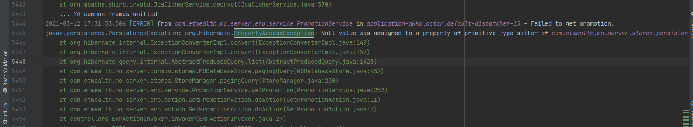

#### 工作中遇到的问题以及简单的学习笔记  

> 整理，整理，整理！！！

#### 一、代码整理及学习部分  

##### 1 并发----`ReentrantReadWriteLock`学习以及使用。  

```java
private final ReentrantReadWriteLock rwl = new ReentrantReadWriteLock(true);
    private final Lock r = rwl.readLock();
    private final Lock w = rwl.writeLock();
```
具体使用：

##### 2 并发----`disruptor`框架。  


##### 3 设置系统session过期时间。  

步骤：   

1. 可在配置文件中先指定一个过期时限。

```properties
#timeout time for user session in minutes
app.user_session.timeout = 120
```

2. 然后在第一次登陆的时候将这个值设置到一个封装好的类中。比如一个session管理类：  

```java
public class SessionManagerService extends AbstractService {

    private static Logger log = LoggerFactory.getLogger(SessionManagerService.class);

    private BiMap<String, LoginUser> sessionStaffMap;
    private Map<String, UserSession> sessionMap;
    private final ReentrantReadWriteLock rwl = new ReentrantReadWriteLock(true);
    private final Lock r = rwl.readLock();
    private final Lock w = rwl.writeLock();
    private Map<String, Consumer<String>> cltBroadcastMap;

    private long sessionTimeoutTime; // 过期时限
    private long backgroundProcessorDelay = 10;
    private boolean backgroundProcessorDone = false;
    private Thread backgroundProcessorThread = null;

    private static final SessionManagerService inst = new SessionManagerService();

    public static SessionManagerService getInstance() {
        return inst;
    }

    public SessionManagerService() {

    }
    ...
    ...
   
    public long getSessionTimeoutTime() {
        return sessionTimeoutTime;
    }
 	// 将过期时限这个值转化成 系统时间的纳秒值(用来判断是否过期)
    public void setSessionTimeoutTime(long sessionTimeoutTime) {
        this.sessionTimeoutTime = TimeUnit.MINUTES.toNanos(sessionTimeoutTime);
    }
}
```

这里备注一下这个方法：`TimeUnit.MINUTES.toNanos()`接收一个long型转化成一个系统运行的纳秒值。然后再到另一个类中写登录用户的session：

```java
public class UserSession {

    private String sessionId;
    private long lastUpdateTime;
    private UserSessionStatus userSessionStatus;
    private String ip;
    private String loginBrowser;
    private String loginOS;
    private Date loginTime;
    public UserSession(String sessionId, String ip, String loginBrowser, String loginOS) {
        this.sessionId = sessionId;
        this.loginBrowser = loginBrowser;
        this.loginOS = loginOS;
        this.loginTime = new Date();
        this.lastUpdateTime = System.nanoTime();
        this.userSessionStatus = UserSessionStatus.ACTIVE;
        this.ip = ip;
    }
    // setter and getter 
    // ...
    
    // 检查是否过期
    public boolean isExpired(long sessionTimeoutTime) {
        return lastUpdateTime + sessionTimeoutTime < System.nanoTime();
    }

    private void renewSession() {
        lastUpdateTime = System.nanoTime();
    }

    public boolean checkAndRenewSession(long sessionTimeoutTime) {
        if (!isExpired(sessionTimeoutTime)) {
            renewSession();
            return true;
        }
        else {
            return false;
        }
    }
```

3. 可以使用任务，在后台一直监控session和登录用户的情况，然后每次都调用检查session是否过期的方法，过期则提示登录过期，重新登录，没有则继续重复循环上面代码的逻辑。逻辑分析：  

```java
public boolean isExpired(long sessionTimeoutTime) {
	return lastUpdateTime + sessionTimeoutTime < System.nanoTime();
}

private void renewSession() {
 	lastUpdateTime = System.nanoTime();
}
public boolean checkAndRenewSession(long sessionTimeoutTime) {
    if (!isExpired(sessionTimeoutTime)) {
        renewSession();
        return true;
    }
    else {
        return false;
    }
}
```

这里`lastUpdateTime + sessionTimeoutTime < System.nanoTime();`，里面的这个方法`System.nanoTime()`，是用来计算：返回正在运行的Java虚拟机的高分辨率时间源的当前值，以纳秒为单位。**此方法只能用于测量经过时间，并且与系统或挂钟时间的任何其他概念无关**。在这里是指系统或者`JVM`运行的时间。  

在每次都检查session是否过期的时候，（没过期的话）每次都用最后更新时间，`private void renewSession() {lastUpdateTime = System.nanoTime();}`也是用的这一个值赋值给`lastUpdateTime`。这就相当于**前面有操作的运行时间 + 过期时间 和总的系统已经运行时间**进行比较。如果前一次对系统有操作的时间到当前最新一次的操作系统时间（这时候`System.nanoTime()`是所有运行的时间）中间间隔了大于过期时间则session过期了。

```java
/**
     * Returns the current value of the running Java Virtual Machine's
     * high-resolution time source, in nanoseconds.
     *
     * <p>This method can only be used to measure elapsed time and is
     * not related to any other notion of system or wall-clock time.
     * The value returned represents nanoseconds since some fixed but
     * arbitrary <i>origin</i> time (perhaps in the future, so values
     * may be negative).  The same origin is used by all invocations of
     * this method in an instance of a Java virtual machine; other
     * virtual machine instances are likely to use a different origin.
     *
     * <p>This method provides nanosecond precision, but not necessarily
     * nanosecond resolution (that is, how frequently the value changes)
     * - no guarantees are made except that the resolution is at least as
     * good as that of {@link #currentTimeMillis()}.
     *
     * <p>Differences in successive calls that span greater than
     * approximately 292 years (2<sup>63</sup> nanoseconds) will not
     * correctly compute elapsed time due to numerical overflow.
     *
     * <p>The values returned by this method become meaningful only when
     * the difference between two such values, obtained within the same
     * instance of a Java virtual machine, is computed.
     *
     * <p> For example, to measure how long some code takes to execute:
     *  <pre> {@code
     * long startTime = System.nanoTime();
     * // ... the code being measured ...
     * long estimatedTime = System.nanoTime() - startTime;}</pre>
     *
     * <p>To compare two nanoTime values
     *  <pre> {@code
     * long t0 = System.nanoTime();
     * ...
     * long t1 = System.nanoTime();}</pre>
     *
     * one should use {@code t1 - t0 < 0}, not {@code t1 < t0},
     * because of the possibility of numerical overflow.
     *
     * @return the current value of the running Java Virtual Machine's
     *         high-resolution time source, in nanoseconds
     * @since 1.5
     */
     public static native long nanoTime();
```

##### 4 velocity模板学习及使用

参考以下链接：
 - https://blog.csdn.net/nengyu/article/details/6671904 
 - https://www.jianshu.com/p/5913903324ff 
 - http://www.51gjie.com/Javaweb/896.htm**l**  

##### 5 枚举类使用时注意事项  

（1）使用枚举类时，枚举类就是一个特殊的常量的一个集合，使用参考链接：[用好Java中的枚举真的没有那么简单](https://github.com/Snailclimb/JavaGuide/blob/master/docs/Java/basis/用好Java中的枚举真的没有那么简单.md)  

（2）使用实例，搭配`switch case`使用  ，[参考](https://blog.csdn.net/bright789/article/details/50987552)   

```java
enum MonthRange {
        ONE_M("1M"), TWO_M("2M"), THREE_M("3M"), FOUR_SIX_M("4-6M"), SEVEN_NINE_M("7-9M"),
        TEN_TWELVE_M("10-12M"), THIRTEEN_SEVENTEEN_M("13-17M"), EIGHTEEN_TWENTY_FOUR("18-24M"), GE_TWENTY_FOUR(">24M"),
        NOM("NOM");

        private String name;

        MonthRange(String name) {
            this.name = name;
        }

        public String getName() {
            return name;
        }

        public static MonthRange getMonthRangeByName(String name) {
            return Arrays.stream(MonthRange.values()).filter(type -> type.getName().equals(name)).findFirst().orElse(NOM);
        }
    }
// ...省略代码，这里有一个过期的月份，根据具体的月份，设置具体的数据
switch (MonthRange.getMonthRangeByName(data.getExpiryMonths())) {
    case ONE_M:
        data.setOneM(data.getTotal());
        break;
    case TWO_M:
        data.setTwoM(data.getTotal());
        break;
    case THREE_M:
        data.setThreeM(data.getTotal());
        break;
    case FOUR_SIX_M:
        data.setFour2SixM(data.getTotal());
        break;
    case SEVEN_NINE_M:
        data.setSeven2NineM(data.getTotal());
        break;
    case TEN_TWELVE_M:
        data.setTen2TwelveM(data.getTotal());
        break;
    case THIRTEEN_SEVENTEEN_M:
        data.setThirteen2SeventeenM(data.getTotal());
        break;
    case EIGHTEEN_TWENTY_FOUR:
        data.setEighteen2TwentyFourM(data.getTotal());
        break;
    case GE_TWENTY_FOUR:
        data.setGeTwentyFourM(data.getTotal());
        break;
}
```

##### 6 `BigDecimal`的一些使用   

以下代码输出的是什么值？

```java
float a = 0.10000001f;
float b = 0.10000000f;
System.out.printf("a==b %b %n", a == b);
float c = 12345678.001f;
float d = 12345678.000f;
System.out.printf("c==d %b", c == d);
```

输出：

```java
a==b false 
c==d true
```

为什么会输出true呢？可以参考：https://cloud.tencent.com/developer/article/1473541。

我们可以看到，变量a和b的差距只有0.00000001，但是他们在内存中所存储的值依然是不同的，a和b比较会返回false。但是对于c和d来说，他们值只差了0.001，小数点后的差距比a和b的差距要大很多，c和d的判断结果依然是相等。**这是由于c和d整数部分占据了4字节太多位置，导致小数部分的数值差距，在4字节内已经体现不出来了**。c和d在内存中存的值是完全一样的。前文所说的零舍一入机制，加上浮点数在内存中本身的存储机制，导致了我们编程中经常被提醒的：“浮点数有精度问题”。

自己将以上的a和b转换成了二进制了

> 0.001的二进制是1.0001 1001 1001 1001 ... * 2^-1无限循环
>
> 12345678.001的二进制是0100 0001 1101 1110 0011 0000 1010 0111.0000 1100 1100 1100...
>
> 12345678.001的二进制是0100 0001 1101 1110 0011 0000 1010 0111.0000

##### 7 string的intern()方法使用  

参考链接：https://tech.meituan.com/2014/03/06/in-depth-understanding-string-intern.html 

```java
// jdk 1.8    
public static void main(String[] args) {
        String s = new String("1");
        s.intern();
        String s2 = "1";
        System.out.println(s == s2);

        String s3 = new String("1")  + new String("1");
        s3.intern();
        String s4 = "11";
        System.out.println(s3 == s4);
    }
// 输出：false  true
```

但是在单元测试类中相同的代码输出却不一样：

```java
public class CastTest {

    @Test
    public void test() {
/*        Object[] a = new Object[2];
        a[0] = null;
        a[1] = 1;
        Integer b = (Integer) a[0];
        System.out.println(b);*/

        String s = new String("1");
        s.intern();
        String s2 = "1";
        System.out.println(s == s2);

        String s3 = new String("1")  + new String("1");
        s3.intern();
        String s4 = "11";
        System.out.println(s3 == s4);
    }
}
// 输出：false  false
```

不明白！！！！

##### 8 linux 和 windows上换行符的区别  

因为这区别导致了解析字符串，在windows上面能解析成功，而Linux上面解析不成功。 windows上的换行符是：`\r\n`

Linux上的换行符是：`\n`

参考博文：https://www.cnblogs.com/cnJavahome/p/8893813.html   https://blog.csdn.net/wzb56_earl/article/details/6860358

##### 9 日志组件slf4J介绍及配置  

https://blog.csdn.net/foreverling/article/details/51385128

##### 10  hibernate的自动记录表数据发生变化的功能   

注解：`@Audited`    :当应用于类时，指示应审核其所有属性。 当应用于字段时，指示应审核此字段

##### 11 Java EE 中ClassLoader获取资源路径问题  

https://www.v2ex.com/t/778724#reply5

假设资源路径在main目录下的resources里面；

在Java SE中，如果使用`ClassLoader.getResource`获取资源（包括`ClassLoader.getResourceAsStream`，下面不再重复），其路径不能以"/"开头。换言之，如果有个`foo.txt`的话，代码

```java
getClass().getClassLoader().getResource("/foo.txt")
```

将返回`null`。

但是我发现，如果在 Java EE 项目中，同样的情况，**加不加"/"均能正常获取资源文件**，这是为什么？

其中一个回答：这个就是 tomcat 自己实现问题.**你应该按照正常得写法,不带 /,**具体你可以看 tomcat 源码,在 9 中,他内部实现: 

```java 
private String nameToPath(String name) { 
    if (name.startsWith("/")) {
        return name; 
    } 
    StringBuilder path = new StringBuilder( 1 + name.length()); 
    path.append('/');
    path.append(name); 
    return path.toString();
}
```

##### 12 修改并查看windows的编码  

https://cloud.tencent.com/developer/article/1353937  可以对其进行修改，

```java
chcp #查看当前cmd的编码格式
chcp 65001   #换成utf-8代码页
chcp 936       #换成默认的gbk
chcp 437       #美国英语
```

idea的控制台输出中文时乱码以及tomcat的服务器时的控制台输出乱码问题：https://blog.csdn.net/qq844579582/article/details/109091374  

##### 13 string 字符串长度限制  

https://www.cnblogs.com/54chensongxia/p/13640352.html

##### 14、Java中正则表达式匹配 \ 要使用 四个 \  

有一种解释：在Java中正则表达式与Java中字符处理是分离的。

首先比如`str.matches("\\\\\")`(不用这个包裹的话自动会变成2个\,str.matches("\\\\\")),进行匹配时，先要将`"\\\\" `转换成一个字符串`"\\"`再交给正则表达式，原因：在Java中`"\\"`代表一个`"\"`，四个杠转义后就代表两个`"\\"`，而两个`"\\"`再最后交给正则表达式，正则表达式转义一次就刚好匹配一个`"\"`。

JAVA中匹配反斜杠的正则表达式的书写方式为：

```java
String regex="\\\\";
```

第一和第三个反斜杠是用作Java字符串的转义，实际上只代表两个反斜杠。

运行代码：

```java
System.out.print("\\\\");// 输出为 \\
```

因此在写其它Java正则表达式时，可以先正出正则表达式原型，再用Java转义字符规则，反转义一次。

原文链接：https://blog.csdn.net/weixin_42469083/article/details/114079369

##### 15 读取配置文件  

```java
private final static String PROPERTIES_PATH = "com/etwealth/mo/server/localPickupInfo.properties";
public static Properties properties = new Properties();

static {
    try {
        properties.load(new InputStreamReader(Objects.requireNonNull(LocalPickupPdfUtils.class.getClassLoader().getResourceAsStream(PROPERTIES_PATH)), StandardCharsets.UTF_8));
    } catch (IOException e) {
        e.printStackTrace();
    }
}
```

##### 16、B+ 树

相关ppt：https://www.cise.ufl.edu/~sahni/cop5536/powerpoint/lec24.ppt 

##### 17、Java代码word转pdf 

https://www.v2ex.com/t/792458#reply29

##### 18、查看JVM参数

https://blog.csdn.net/guyue35/article/details/107957859

类别1: 其一是标准参数（-），所有的JVM实现都必须实现这些参数的功能，而且向后兼容；

类别2: 其二是非标准参数（-X），默认jvm实现这些参数的功能，但是并不保证所有jvm实现都满足，且不保证向后兼容；

类别3: 其三是非Stable参数（-XX），此类参数各个jvm实现会有所不同，将来可能会随时取消，需要慎重使用；

**JVM 标准参数**

获取方法: java -help

**JVM 非标准参数**

获取方法: java -X

##### JVM非Stable参数（-XX）

获取方法: java -XX:+PrintFlagsInitial  

##### 19 double 除 0 错误

```java
public void test() {
    double a = 0d;
    double b = 0d;
    double c = a/b;
    System.out.println(c);
}
输出：NAN
```

导致设置属性的时候，一个double 属性设置成了 NaN，转化 JSON 失败，报错。

解决：判断是否 除数是0，为0，直接设置结果为 0。

double 类源码部分

```java
/**
 * A constant holding the positive infinity of type
 * {@code double}. It is equal to the value returned by
 * {@code Double.longBitsToDouble(0x7ff0000000000000L)}.
 */
public static final double POSITIVE_INFINITY = 1.0 / 0.0;

/**
 * A constant holding the negative infinity of type
 * {@code double}. It is equal to the value returned by
 * {@code Double.longBitsToDouble(0xfff0000000000000L)}.
 */
public static final double NEGATIVE_INFINITY = -1.0 / 0.0;

/**
 * A constant holding a Not-a-Number (NaN) value of type
 * {@code double}. It is equivalent to the value returned by
 * {@code Double.longBitsToDouble(0x7ff8000000000000L)}.
 */
public static final double NaN = 0.0d / 0.0;
```

##### 20 java发送 http请求

```java
CloseableHttpClient httpClient = HttpClients.createDefault();
            CloseableHttpResponse httpResponse = null;
            try {
                HttpPost httpPost = new HttpPost(payDollarUrl);
                
                List<NameValuePair> paramList = new ArrayList<>();  
                               
                paramList.add(new BasicNameValuePair("merchantId", "88153061"));
                paramList.add(new BasicNameValuePair("amount", request.getPayAmt().toString()));
                paramList.add(new BasicNameValuePair("orderRef", request.getOrderRef()));
                paramList.add(new BasicNameValuePair("currCode", "344"));
                paramList.add(new BasicNameValuePair("mpsMode", "NIL"));
                //just sample url to forward
                paramList.add(new BasicNameValuePair("successUrl", "http://www.baidu.com"));// It could actually be http://192.168.2.55:9002/oftp/i/payDollarSuccess
                paramList.add(new BasicNameValuePair("failUrl", "http://www.baidu.com"));// It could actually be http://192.168.2.55:9002/oftp/i/payDollarFail
                paramList.add(new BasicNameValuePair("cancelUrl", "http://www.baidu.com"));// It could actually be http://192.168.2.55:9002/oftp/i/payDollarCancel
                paramList.add(new BasicNameValuePair("payType", "N"));
                paramList.add(new BasicNameValuePair("lang", "E"));
                paramList.add(new BasicNameValuePair("payMethod", "CC"));
                paramList.add(new BasicNameValuePair("secureHash", "44f3760c201d3688440f62497736bfa2aadd1bc0"));
                
                
                UrlEncodedFormEntity entity = new UrlEncodedFormEntity(paramList, "utf-8");
                httpPost.setEntity(entity);
                httpResponse = httpClient.execute(httpPost);
                
                String resultString = EntityUtils.toString(httpResponse.getEntity(), "utf-8");                
                response.setResponseInputStream(httpResponse.getEntity().getContent());
                response.setEntryString(resultString);
```

##### 21 java 8 map 排序

```java
Map result = map.entrySet().stream()
	.sorted(Map.Entry.comparingByKey())
	.collect(Collectors.toMap(Map.Entry::getKey, Map.Entry::getValue,
	(oldValue, newValue) -> oldValue, LinkedHashMap::new));
```

##### 22 try catch finally return 输出问题 

1. **try 中带有 return**

```java
private int testReturn1() {
    int i = 1;
    try {
        i++;
        System.out.println("try:" + i);
        return i;
    } catch (Exception e) {
        i++;
        System.out.println("catch:" + i);
    } finally {
        i++;
        System.out.println("finally:" + i);
    }
    return i;
}
// 输出, i 是基本类型
try:2
finally:3
2
```

因为当try中带有return时，会先执行return前的代码，然后暂时保存需要return的信息，再执行finally中的代码，最后再通过return返回之前保存的信息。所以，这里方法返回的值是try中计算后的2，而非finally中计算后的3。但是返回的变量是 引用类型则不一样。

```java 
private List<Integer> testReturn2() {
    List<Integer> list = new ArrayList<>();
    try {
        list.add(1);
        System.out.println("try:" + list);
        return list;
    } catch (Exception e) {
        list.add(2);
        System.out.println("catch:" + list);
    } finally {
        list.add(3);
        System.out.println("finally:" + list);
    }
    return list;
}
// 输出，list 是引用类型
try:[1]
finally:[1, 3]
[1, 3]
```

2. **catch中带有return**

```java
private int testReturn3() {
    int i = 1;
    try {
        i++;
        System.out.println("try:" + i);
        int x = i / 0 ;
    } catch (Exception e) {
        i++;
        System.out.println("catch:" + i);
        return i;
    } finally {
        i++;
        System.out.println("finally:" + i);
    }
    return i;
}
// 输出
try:2
catch:3
finally:4
返回的是 catch 块中的 3
```

3. **finally中带有return**

```java
private int testReturn4() {
    int i = 1;
    try {
        i++;
        System.out.println("try:" + i);
        return i;
    } catch (Exception e) {
        i++;
        System.out.println("catch:" + i);
        return i;
    } finally {
        i++;
        System.out.println("finally:" + i);
        return i;
    }
}
// 输出
try:2
finally:3
3
```

**总结**：

1、finally中的代码总会被执行。

2、当try、catch中有return时，也会执行finally。return的时候，要注意返回值的类型，是否受到finally中代码的影响。

3、finally中有return时，会直接在finally中退出，导致try、catch中的return失效。

##### 23 try catch finally 异常抛出问题 

```java
public class ThrowExceptionTest {
    public static void main(String[] args) throws Exception {
        // 1
        try {
            try {
                throw new Sneeze();
            } catch (Annoyance e) {
                System.out.println("Caught Annoyance!");
                throw e;
            }
        } catch (Sneeze e2) {
            System.out.println("Caught Sneeze!");
        } finally {
            System.out.println("Caught complete!");
        }
        /**
         * 输出：
         * Caught Annoyance!
         * Caught Sneeze!
         * Caught complete!
         * catch (Annoyance e) 是 父类的引用，但实际上是子类的对象，这是多态。在catch (Sneeze e2)
         * 的时候当然可以捕获到自己抛出来的异常了。
         */
        //2 子类从本质上是无法捕获父类的异常的。
        /*System.out.println("测试子类异常无法捕获父类异常，也就是无法捕获比自己小的异常");
        try {
            throw new Annoyance();
        } catch (Sneeze s) {
            System.out.println("Caught Sneeze");
        } finally {
            System.out.println("Caught complete!");
        }
        // 输出
        // 
*/
        // 3
        System.out.println("使用更大范围的异常捕获");
        try {
            throw new Annoyance();
        } catch (Sneeze s) {
            System.out.println("Caught Sneeze");
        } catch (Exception e) {
            System.out.println("Caught Exception");
        } finally {
            System.out.println("Hello World!");
        }
        
    }
}
```

1 情况输出

```java
Caught Annoyance!
Caught Sneeze!
Caught complete!
```

2 情况输出

```java
测试子类异常无法捕获父类异常，也就是无法捕获比自己小的异常
Caught complete!
Exception in thread "main" com.lanwq.thinkinginjavademo.exceptiontest.Annoyance
	at com.lanwq.thinkinginjavademo.exceptiontest.ThrowExceptionTest.main(ThrowExceptionTest.java:34)
```

3 情况输出

```java
使用更大范围的异常捕获
Caught Exception
Hello World!
```

上述例子说明了，catch() 括号里的异常，起码要是 try 中抛出异常的同类或者父类才能被捕获到，要范围大于或者等于才行。

##### 24 java 手动分页 

```java
int start = 0, maxResults = 0;
if (request.getForm().getPageSize() == 0) {
    start = 0;
    maxResults = Integer.MAX_VALUE;
}
else {
    maxResults = request.getForm().getPageSize();
    start = (request.getForm().getCurrentPage() - 1) * maxResults;
}
// rList 是查询出的所有结果，start 是开始坐标 也就是i类似于第一页是 0,12 
// 第二页是 12 24,一共 30个记录的话
int size = rList.size();
int toIndex = start + maxResults; // 第一页时，(0,12)，第二页时，(12, 24)，第三页(24, 36)，因为 toIndex > size 所以就是 (24, 30) 了
if (toIndex > size) {
    toIndex = size;
}
if(size > start) {
    resultList = rList.subList(start, toIndex);
}
```


#### 二、Play framework 框架相关知识点

##### （1）get请求参数传递  

参考：[链接](https://developer.ibm.com/zh/articles/j-lo-play/#)  https://www.cnblogs.com/shianliang/p/8657250.html

在控制层实现中很繁琐但是必不可少的操作就是解析 HTTP 请求中的参数。不同的 Web 开发框架会提供自己的参数解析方式。Play 框架也提供了相应的支持。Play 框架可以解析 HTTP 请求中查询字符串和 URI 路径中包含的以及请求体中以格式编码的参数。所有这些参数都放在 `params` 对象中，其中包含 `get()`、 `getAll()` 和 `put()` 等方法用来获取和设置参数的值。除了这种传统的使用方式之外，Play 框架还支持直接把参数的值绑定到动作方法的参数上面。比如一个动作方法的声明是 `show(String username)` ，那么请求中的参数 `username` 的值会在 `show()` 方法被调用时作为实际参数传递进去。Play 框架会负责完成相应的类型转换。值得一提的是对于日期类型（`Java.util.Date`）的参数，Play 框架支持多种类型的日期格式的转换。比如动作方法的声明是 `display(Date postedAt)` ，而请求的格式可能是 `/display?postedAt=2010-09-22` ，Play 框架会自动完成相应的类型转换。

除了常见的基本数据类型之外，Play 框架还支持直接绑定领域对象的实例。比如动作方法的声明是 `create(Note note)`，可以在参数中直接指定对象实例的属性的值。请求的格式可能是 `/create?title=Note123&content=Good` 。Play 框架会负责创建一个 `Note` 类的实例，并根据参数的值设置该实例的属性 `title` 和 `content` 的值。这种绑定方式不仅支持简单对象，还支持嵌套对象和列表。比如 `/create?tags[0]=ajax&tags[1]=web` 可以设置列表类型属性 `tags` 的值。

Play 框架的这种绑定方式还支持文件对象，使得上传文件变得非常简单。只需要在表单中添加文件上传的控件（ `<input type="file">` ）并使用 `multipart/form-data` 编码来提交请求，在动作方法的参数中就可以获取到上传文件对应的 `Java.io.File` 对象。比如动作方法的声明可能是 `upload(File picture)` 。上传的文件被保存在临时目录中，在请求完成之后会被自动删除。可以在动作方法中完成对上传文件的操作。   

例如：

```java
url:http://192.168.2.116:9000/OFTP/i/changeHomeClientInfo?action=change_email&token=BiRhTC64F2G094A6rVRUg5CAc31Cd2WnMmIQFcflowEjjwF02aMsVaT1x6AIX5Gk5MtIoegZcadl0CykClXhjJleW9mFcNlOWZssyAQQxfm8Q5W/gAFYHySKeP5Gldbd

GET         /:systemId/i/changeHomeClientInfo                         controllers.SystemController.checkEmailAndReturn(systemId: String, action: String, token: String)

action:
public Result checkEmailAndReturn(String systemId, String action, String token) {
        systemId = StringUtils.upperCase(systemId);
        Logger.info("checkEmailAndReturn", systemId);
        CheckEmailInfoRequest request = new CheckEmailInfoRequest();
        request.setAction(action);
        request.setToken(token);
        request.setSystemId(systemId);

        BaseResponse response =
                ActionInvoker.invoker(CheckEmailInfoAction.class, request);
        Logger.info("checkEmailAndReturn,  <{}>", response.getReturnCode());
        if(response.getReturnCode() != ErrorCode.Success) {
            return redirect("http://127.0.0.1:8080/home/#!/link/changeInfoFailed").withHeader("resultHeader", GsonBuilder.create().toJson(response));
        }
        return redirect("http://127.0.0.1:8080/home/#!/link/changeInfoWithEmailSuccess").withHeader("resultHeader", GsonBuilder.create().toJson(response));
    }
```

##### （2）前端时间字符串，传递后端，通过Json Format转化

前端传递到后端要是”yyyyMMddHHmmss“这种格式的字符串才能转化

例如：前端格式

```javascript
// $scope.promotionDiscount.orderDateFrom 这是时间选择的一个插件
var _data = {
            orderDateFrom: moment($scope.promotionDiscount.orderDateFrom, 'YYYYMMDDHHmmss').format('YYYYMMDD') + '000000',
            orderDateTo: moment($scope.promotionDiscount.orderDateTo, 'YYYYMMDDHHmmss').format('YYYYMMDD') + '235959'
        };
        return $scope.viewStmt(type, _data);
```

后端接收：

```Java
package com.etwealth.mo.server.request;

import com.fasterxml.jackson.annotation.JsonFormat;
import play.data.format.Formats;

import Java.util.Date;

public class StockAgingReportRequest extends BaseRequest {
    
    @Formats.DateTime(pattern = "yyyyMMddHHmmss")
    @JsonFormat(shape = JsonFormat.Shape.STRING, pattern = "yyyyMMddHHmmss", timezone = "GMT+8")
    private Date asAtDay;

    public Date getAsAtDay() {
        return asAtDay;
    }

    public void setAsAtDay(Date asAtDay) {
        this.asAtDay = asAtDay;
    }
}
```

##### （3）启动的时候使用 run 命令加参数

https://www.playframework.com/documentation/2.8.x/ProductionConfiguration#Server-configuration-options 

https://www.playframework.com/documentation/2.2.x/ProductionConfiguration#Specifying-additional-JVM-arguments

##### （4）内存问题

https://www.scala-sbt.org/1.x/docs/Troubleshoot-Memory-Issues.html#Troubleshoot+memory+issues 

启动报错：

https://stackoverflow.com/questions/34318705/why-does-sbt-compile-fail-with-stackoverflowerror/69010040

在当前项目下创建一个文件 `.sbtopts` ,内容是 jvm 的一些启动参数

>```java
>-J-Xmx1G
>-J-Xss4M
>```

##### （4）前端传递的post请求的body的转换  

```java
import play.libs.Json;

SearchClientProfitLossForm form = Json.fromJson(request().body().asJson(), SearchClientProfitLossForm.class);

import play.data.FormFactory;
@Inject
private FormFactory formFactory;
GetProductOrderbookForm form = formFactory.form(GetProductOrderbookForm.class).bindFromRequest().get();
```


#### 三、hibernate使用过程中踩到的坑  

##### （1）`spring`配置`hibernate`的`SessionFactory`  

```xml
<bean id="SessionFactory"
		class="org.springframework.orm.hibernate4.LocalSessionFactoryBean">
		<property name="mappingResources" value="/com/etwealth/mo/server/services/hbm.xml" />
        <property name="annotatedClasses" value="com.etwealth.mo.server.stores.envers.OftpRevision" />
		<property name="hibernateProperties">
			<props>
				<prop key="hibernate.connection.provider_class">org.hibernate.connection.C3P0ConnectionProvider</prop>
				<prop key="hibernate.connection.driver_class">${store.persistent.driver_class}</prop>
				<prop key="hibernate.connection.url">${store.persistent.url}</prop>
				<prop key="hibernate.connection.username">${store.persistent.userName}</prop>
				<prop key="hibernate.connection.password">${store.persistent.password}</prop>
				<prop key="hibernate.connection.CharSet">utf8</prop>
				<prop key="hibernate.connection.characterEncoding">utf8</prop>
				<prop key="hibernate.connection.useUnicode">true</prop>
				<prop key="hibernate.dialect">${store.persistent.dialect}</prop>
				<prop key="hibernate.jdbc.fetch_size">1000</prop>
				<prop key="hibernate.show_sql">true</prop>
				<prop key="hibernate.c3p0.min_size">5</prop>
				<prop key="hibernate.c3p0.max_size">20</prop>
				<prop key="hibernate.c3p0.timeout">1800</prop>
				<prop key="hibernate.c3p0.max_statements">0</prop>
				<prop key="hibernate.c3p0.acquire_increment">3</prop>
				<prop key="hibernate.c3p0.idle_test_period">300</prop>
				<prop key="hibernate.c3p0.validate">false</prop>
				<prop key="hibernate.jdbc.batch_size">20</prop>
				<prop key="hibernate.current_session_context_class">thread</prop>
				<prop key="hibernate.hbm2ddl.auto">update</prop>
				<prop key="org.hibernate.envers.store_data_at_delete">true</prop>
			</props>
		</property>
	</bean>
```
账号密码有些使用了加密

```properties
#MySQL / Oracle User Name
store.persistent.userName = root
store.persistent.passwordkey = com/etwealth/mo/server/security/master.key
store.persistent.password = 123456
# MySQL
store.persistent.url = jdbc:mysql://127.0.0.1:3306/etwtp?useSSL=false&zeroDateTimeBehavior=convertToNull
store.persistent.driver_class = com.mysql.jdbc.Driver
store.persistent.dialect = com.etwealth.mo.server.dbadapter.MySQL5Dialect

# Oracle
#store.persistent.url = jdbc:oracle:thin:@127.0.0.1:1521:orcl
#store.persistent.driver_class = oracle.jdbc.OracleDriver
#store.persistent.dialect = com.etwealth.mo.server.dbadapter.Oracle10gDialect
#store.persistent.dialect = com.etwealth.mo.server.dbadapter.Oracle12cDialect
```

##### （2）查询时候配置了相应的映射，查询调用的`API`返回的是`List<object[]>`数组集合，但是具体返回的确实`List<ConcrementElement>`的集合。  


（3）hibernate查询映射时，报以下错误：

```java
Javax.persistence.PersistenceException: org.hibernate.PropertyAccessException: Null value was assigned to a property of primitive type setter of com.etwealth.mo.server.stores.persistent.datatype.erp.PromotionRec.priority
```




网上查询到：[链接](https://stackoverflow.com/questions/3154582/why-do-i-get-a-null-value-was-assigned-to-a-property-of-primitive-type-setter-o) A null value cannot be assigned to a primitive type, like int, long, boolean, etc。

#### 四、其他的一些API使用  

##### 1、`ReflectionToStringBuilder`使用

```java
org.apache.commons.lang3.builder
```

##### 2、httpCore，httpClient的发送请求的一些使用

http请求header相关的常量在 `org.apache.http.protocol.HTTP` 中，使用直接可以：

```java
 httpPost.setHeader(HTTP.CONTENT_TYPE, "application/x-www-form-urlencoded");
```


#### 五、Firebase Cloud Messaging （FCM）消息服务

参考：[博客](https://blog.csdn.net/zhenghhgz/article/details/103404140) [java FCM 总结](https://www.cnblogs.com/feiqiangsheng/p/10885618.html)

[官方文档](https://firebase.google.cn/docs/cloud-messaging) [消息配置](https://firebase.google.com/docs/reference/fcm/rest/v1/projects.messages?authuser=0) 

