### MySQL数据库笔记

[官方文档](https://dev.mysql.com/doc/refman/8.0/en/) 

> DDL is Data Definition Language which is used to define data structures. For example: create table, alter table are instructions in SQL
>
> DDL 是指数据定义语言，用来定义数据的结构。例如，create table , alter table 语句。
>
> DML is Data Manipulation Language which is used to manipulate data itself. For example: insert, update, delete are instructions in SQL.
>
> DML 是指数据操作语言，用来操作数据，比如 insert ,update 和 delete 等语句

#### 一、查询语句相关  

##### 1、时间相关的函数

- `STR_TO_DATE()`函数的语法：

```mysql
STR_TO_DATE(str, fmt)
```
`STR_TO_DATE()`根据`fmt`的格式，将字符串`str`转换成日期值，`STR_TO_DATE()`函数可能会根据输入的格式，格式化字符串返回`DATE`,`TIME`,`DATETIME`值，如果输入的字符串是非法的，则`STR_TO_DATE()`函数返回 `NULL`。  具体的可以参考：[链接](https://www.yiibai.com/mysql/str_to_date.html)  

示例：

```mysql
SELECT
      ia.input_date AS INPUT_DATE,
      ia.adj_id AS ADJ_ID,
      ia.`action` AS `ACTION`,
      ia.from_warehouse_id AS FORM_WAREHOUSE_ID,
      ia.to_warehouse_id AS TO_WAREHOUSE_ID,
      ia.total_cost AS TOTAL_COST,
      ia.total_amount AS TOTAL_AMOUNT
FROM
      inventory_adj ia
WHERE
      ia.input_date >= str_to_date('2018-11-01',
      '%Y-%m-%d')
      AND ia.input_date <= str_to_date('2018-11-06',
      '%Y-%m-%d')
-- 转化
SELECT str_to_date('2020-12-03', '%Y-%m-%d') AS dated;
结果为
dated     |
----------|
2020-12-03|
```

- 当前时间`current_date()`、两个日期之间相差多少t天`DATEDIFF`  、相差多少个月`timestampdiff(month, startTime, endTime)`  

参考学习链接：https://www.cnblogs.com/ggjucheng/p/3352280.html

```mysql
  SELECT current_date() FROM DUAL; 
  -- 两个日期之间相差多少天
  select DATEDIFF('2008-08-08', '2008-08-01');
  -- 两个日期之间相差多少个月
  select timestampdiff(MONTH,'2008-08-08', '2008-07-01');
  -- 最近30天
  SELECT
  	*
  FROM
  	sales_order so
  WHERE
  	date_sub('2020-12-21',INTERVAL 30 DAY) <= date(so.order_date)
  ORDER BY
  	so.order_date ASC;
  -- 查询月份
  SELECT MONTH(curdate()) ; 
```

MySQL官网的date和time的函数：https://dev.mysql.com/doc/refman/8.0/en/date-and-time-functions.html 

| Name                                                         | Description                                                  |
| :----------------------------------------------------------- | :----------------------------------------------------------- |
| [`ADDDATE()`](https://dev.mysql.com/doc/refman/8.0/en/date-and-time-functions.html#function_adddate) | Add time values (intervals) to a date value                  |
| [`ADDTIME()`](https://dev.mysql.com/doc/refman/8.0/en/date-and-time-functions.html#function_addtime) | Add time                                                     |
| [`CONVERT_TZ()`](https://dev.mysql.com/doc/refman/8.0/en/date-and-time-functions.html#function_convert-tz) | Convert from one time zone to another                        |
| [`CURDATE()`](https://dev.mysql.com/doc/refman/8.0/en/date-and-time-functions.html#function_curdate) | Return the current date                                      |
| [`CURRENT_DATE()`, `CURRENT_DATE`](https://dev.mysql.com/doc/refman/8.0/en/date-and-time-functions.html#function_current-date) | Synonyms for CURDATE()                                       |
| [`CURRENT_TIME()`, `CURRENT_TIME`](https://dev.mysql.com/doc/refman/8.0/en/date-and-time-functions.html#function_current-time) | Synonyms for CURTIME()                                       |
| [`CURRENT_TIMESTAMP()`, `CURRENT_TIMESTAMP`](https://dev.mysql.com/doc/refman/8.0/en/date-and-time-functions.html#function_current-timestamp) | Synonyms for NOW()                                           |
| [`CURTIME()`](https://dev.mysql.com/doc/refman/8.0/en/date-and-time-functions.html#function_curtime) | Return the current time                                      |
| [`DATE()`](https://dev.mysql.com/doc/refman/8.0/en/date-and-time-functions.html#function_date) | Extract the date part of a date or datetime expression       |
| [`DATE_ADD()`](https://dev.mysql.com/doc/refman/8.0/en/date-and-time-functions.html#function_date-add) | Add time values (intervals) to a date value                  |
| [`DATE_FORMAT()`](https://dev.mysql.com/doc/refman/8.0/en/date-and-time-functions.html#function_date-format) | Format date as specified                                     |
| [`DATE_SUB()`](https://dev.mysql.com/doc/refman/8.0/en/date-and-time-functions.html#function_date-sub) | Subtract a time value (interval) from a date                 |
| [`DATEDIFF()`](https://dev.mysql.com/doc/refman/8.0/en/date-and-time-functions.html#function_datediff) | Subtract two dates                                           |
| [`DAY()`](https://dev.mysql.com/doc/refman/8.0/en/date-and-time-functions.html#function_day) | Synonym for DAYOFMONTH()                                     |
| [`DAYNAME()`](https://dev.mysql.com/doc/refman/8.0/en/date-and-time-functions.html#function_dayname) | Return the name of the weekday                               |
| [`DAYOFMONTH()`](https://dev.mysql.com/doc/refman/8.0/en/date-and-time-functions.html#function_dayofmonth) | Return the day of the month (0-31)                           |
| [`DAYOFWEEK()`](https://dev.mysql.com/doc/refman/8.0/en/date-and-time-functions.html#function_dayofweek) | Return the weekday index of the argument                     |
| [`DAYOFYEAR()`](https://dev.mysql.com/doc/refman/8.0/en/date-and-time-functions.html#function_dayofyear) | Return the day of the year (1-366)                           |
| [`EXTRACT()`](https://dev.mysql.com/doc/refman/8.0/en/date-and-time-functions.html#function_extract) | Extract part of a date                                       |
| [`FROM_DAYS()`](https://dev.mysql.com/doc/refman/8.0/en/date-and-time-functions.html#function_from-days) | Convert a day number to a date                               |
| [`FROM_UNIXTIME()`](https://dev.mysql.com/doc/refman/8.0/en/date-and-time-functions.html#function_from-unixtime) | Format Unix timestamp as a date                              |
| [`GET_FORMAT()`](https://dev.mysql.com/doc/refman/8.0/en/date-and-time-functions.html#function_get-format) | Return a date format string                                  |
| [`HOUR()`](https://dev.mysql.com/doc/refman/8.0/en/date-and-time-functions.html#function_hour) | Extract the hour                                             |
| [`LAST_DAY`](https://dev.mysql.com/doc/refman/8.0/en/date-and-time-functions.html#function_last-day) | Return the last day of the month for the argument            |
| [`LOCALTIME()`, `LOCALTIME`](https://dev.mysql.com/doc/refman/8.0/en/date-and-time-functions.html#function_localtime) | Synonym for NOW()                                            |
| [`LOCALTIMESTAMP`, `LOCALTIMESTAMP()`](https://dev.mysql.com/doc/refman/8.0/en/date-and-time-functions.html#function_localtimestamp) | Synonym for NOW()                                            |
| [`MAKEDATE()`](https://dev.mysql.com/doc/refman/8.0/en/date-and-time-functions.html#function_makedate) | Create a date from the year and day of year                  |
| [`MAKETIME()`](https://dev.mysql.com/doc/refman/8.0/en/date-and-time-functions.html#function_maketime) | Create time from hour, minute, second                        |
| [`MICROSECOND()`](https://dev.mysql.com/doc/refman/8.0/en/date-and-time-functions.html#function_microsecond) | Return the microseconds from argument                        |
| [`MINUTE()`](https://dev.mysql.com/doc/refman/8.0/en/date-and-time-functions.html#function_minute) | Return the minute from the argument                          |
| [`MONTH()`](https://dev.mysql.com/doc/refman/8.0/en/date-and-time-functions.html#function_month) | Return the month from the date passed                        |
| [`MONTHNAME()`](https://dev.mysql.com/doc/refman/8.0/en/date-and-time-functions.html#function_monthname) | Return the name of the month                                 |
| [`NOW()`](https://dev.mysql.com/doc/refman/8.0/en/date-and-time-functions.html#function_now) | Return the current date and time                             |
| [`PERIOD_ADD()`](https://dev.mysql.com/doc/refman/8.0/en/date-and-time-functions.html#function_period-add) | Add a period to a year-month                                 |
| [`PERIOD_DIFF()`](https://dev.mysql.com/doc/refman/8.0/en/date-and-time-functions.html#function_period-diff) | Return the number of months between periods                  |
| [`QUARTER()`](https://dev.mysql.com/doc/refman/8.0/en/date-and-time-functions.html#function_quarter) | Return the quarter from a date argument                      |
| [`SEC_TO_TIME()`](https://dev.mysql.com/doc/refman/8.0/en/date-and-time-functions.html#function_sec-to-time) | Converts seconds to 'hh:mm:ss' format                        |
| [`SECOND()`](https://dev.mysql.com/doc/refman/8.0/en/date-and-time-functions.html#function_second) | Return the second (0-59)                                     |
| [`STR_TO_DATE()`](https://dev.mysql.com/doc/refman/8.0/en/date-and-time-functions.html#function_str-to-date) | Convert a string to a date                                   |
| [`SUBDATE()`](https://dev.mysql.com/doc/refman/8.0/en/date-and-time-functions.html#function_subdate) | Synonym for DATE_SUB() when invoked with three arguments     |
| [`SUBTIME()`](https://dev.mysql.com/doc/refman/8.0/en/date-and-time-functions.html#function_subtime) | Subtract times                                               |
| [`SYSDATE()`](https://dev.mysql.com/doc/refman/8.0/en/date-and-time-functions.html#function_sysdate) | Return the time at which the function executes               |
| [`TIME()`](https://dev.mysql.com/doc/refman/8.0/en/date-and-time-functions.html#function_time) | Extract the time portion of the expression passed            |
| [`TIME_FORMAT()`](https://dev.mysql.com/doc/refman/8.0/en/date-and-time-functions.html#function_time-format) | Format as time                                               |
| [`TIME_TO_SEC()`](https://dev.mysql.com/doc/refman/8.0/en/date-and-time-functions.html#function_time-to-sec) | Return the argument converted to seconds                     |
| [`TIMEDIFF()`](https://dev.mysql.com/doc/refman/8.0/en/date-and-time-functions.html#function_timediff) | Subtract time                                                |
| [`TIMESTAMP()`](https://dev.mysql.com/doc/refman/8.0/en/date-and-time-functions.html#function_timestamp) | With a single argument, this function returns the date or datetime expression; with two arguments, the sum of the arguments |
| [`TIMESTAMPADD()`](https://dev.mysql.com/doc/refman/8.0/en/date-and-time-functions.html#function_timestampadd) | Add an interval to a datetime expression                     |
| [`TIMESTAMPDIFF()`](https://dev.mysql.com/doc/refman/8.0/en/date-and-time-functions.html#function_timestampdiff) | Return the difference of two datetime expressions, using the units specified |
| [`TO_DAYS()`](https://dev.mysql.com/doc/refman/8.0/en/date-and-time-functions.html#function_to-days) | Return the date argument converted to days                   |
| [`TO_SECONDS()`](https://dev.mysql.com/doc/refman/8.0/en/date-and-time-functions.html#function_to-seconds) | Return the date or datetime argument converted to seconds since Year 0 |
| [`UNIX_TIMESTAMP()`](https://dev.mysql.com/doc/refman/8.0/en/date-and-time-functions.html#function_unix-timestamp) | Return a Unix timestamp                                      |
| [`UTC_DATE()`](https://dev.mysql.com/doc/refman/8.0/en/date-and-time-functions.html#function_utc-date) | Return the current UTC date                                  |
| [`UTC_TIME()`](https://dev.mysql.com/doc/refman/8.0/en/date-and-time-functions.html#function_utc-time) | Return the current UTC time                                  |
| [`UTC_TIMESTAMP()`](https://dev.mysql.com/doc/refman/8.0/en/date-and-time-functions.html#function_utc-timestamp) | Return the current UTC date and time                         |
| [`WEEK()`](https://dev.mysql.com/doc/refman/8.0/en/date-and-time-functions.html#function_week) | Return the week number                                       |
| [`WEEKDAY()`](https://dev.mysql.com/doc/refman/8.0/en/date-and-time-functions.html#function_weekday) | Return the weekday index                                     |
| [`WEEKOFYEAR()`](https://dev.mysql.com/doc/refman/8.0/en/date-and-time-functions.html#function_weekofyear) | Return the calendar week of the date (1-53)                  |
| [`YEAR()`](https://dev.mysql.com/doc/refman/8.0/en/date-and-time-functions.html#function_year) | Return the year                                              |
| [`YEARWEEK()`](https://dev.mysql.com/doc/refman/8.0/en/date-and-time-functions.html#function_yearweek) | Return the year and week                                     |

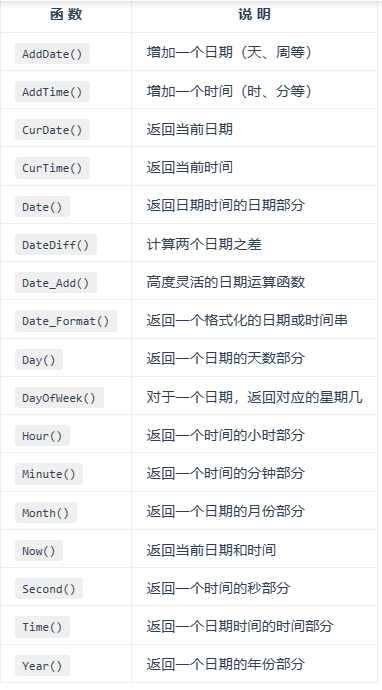


##### 2、字符串相关的函数

- `CONCAT()函数`。[参考学习链接](https://blog.csdn.net/qq_35211818/article/details/78977276)  

`CONCAT()函数`用于将多个字符串连接成一个字符串。使用语法：`CONCAT(str1,str2,…)`。返回结果为连接参数产生的字符串。**如有任何一个参数为NULL ，则返回值为 NULL**。可以有一个 或多个参数。

```mysql
SELECT concat('my',NULL, 'sql') AS resulta; 
-- 返回结果
resulta|
-------|
       |
       
SELECT concat('my','-', 'sql') AS resulta; 
-- 返回结果
resulta|
-------|
my-sql |
```

- `CONCAT_WS()` 指定参数之间的分隔符。

使用语法为：`CONCAT_WS(separator,str1,str2,…)`。 `CONCAT_WS()` 代表` CONCAT With Separator` ，是`CONCAT()`的特殊形式。第一个参数是其它参数的分隔符。分隔符的位置放在要连接的两个字符串之间。分隔符可以是一个字符串，也可以是其它参数。注意点：**如果分隔符为 NULL，则结果为 NULL。函数会忽略任何分隔符参数后的 NULL 值**。但是CONCAT_WS()不会忽略任何空字符串。 (然而会忽略所有的 NULL）。    

```mysql
SELECT CONCAT_WS("-",YEAR(curdate()) + 1,"12-31") AS resulta; 
-- 返回结果
resulta   |
----------|
2022-12-31|
SELECT CONCAT_WS("-",NULL ,"12-31") AS resulta; 
-- 返回结果
resulta|
-------|
12-31  |
```

- `GROUP_CONCAT`函数，函数返回一个字符串结果，该结果由分组中的值连接组合而成。    

参考官网学习链接：[博客](https://blog.csdn.net/qq_35211818/article/details/78977276)， [官网介绍](https://dev.mysql.com/doc/refman/8.0/en/aggregate-functions.html#function_group-concat)  ，This function returns a string result with the concatenated non-`NULL` values from a group. It returns `NULL` if there are no non-`NULL` values。 

```mysql
-- 语法
GROUP_CONCAT([DISTINCT] expr [,expr ...]
             [ORDER BY {unsigned_integer | col_name | expr}
                 [ASC | DESC] [,col_name ...]]
             [SEPARATOR str_val])
            
mysql> SELECT student_name,
GROUP_CONCAT(test_score)
FROM student
GROUP BY student_name;
-- or 
mysql> SELECT student_name,
GROUP_CONCAT(DISTINCT test_score ORDER BY test_score DESC SEPARATOR ' ')
FROM student
GROUP BY student_name;

-- 示例
SELECT warehouse_id, GROUP_CONCAT(DISTINCT ih2.`action`) FROM inventory_hist ih2 GROUP BY warehouse_id LIMIT 0,10;
-- 结果
warehouse_id|resulta                        |
------------|-------------------------------|
1           |ADD,RDC,RDCS,SCRP,SELL,TRS,TRSI|
100         |SELL,TRS,TRSI                  |
101         |RDC,TRS,TRSI                   |
102         |TRS,TRSI                       |
103         |TRS,TRSI                       |
104         |SELL,TRSI                      |
105         |RDC,SELL,TRS,TRSI              |
106         |RDC,SELL,TRS,TRSI              |
107         |TRS,TRSI                       |
108         |SCRP,SELL,TRSI                 |
```

##### 3、使用数据库查询出还剩多少个月过期：  

```mysql
-- 和当前时间比较，1M=一个月内过期 ，2M=两个月内过期。。。
SELECT
	concat(p.orig_product_id, ' ', p.name_en) AS CODE_AND_NAME,
	i.lot_id AS LOT_ID,
	i.received_date AS RECEIVED_DATE,
	i.expiry_date AS EXPIRY_DATE,
	i.inventory_id AS INVENTORY_ID,
	i.qty_qoh AS QTY_QOH,
	i.qty_qoh * i.cost_base_ccy AS TOTAL,
	CASE
		WHEN i.expiry_date = DATE_ADD(current_date(), INTERVAL 1 MONTH) OR timestampdiff(MONTH, current_date(), i.expiry_date) = 0  
		THEN '1M'
		
		WHEN i.expiry_date > DATE_ADD(current_date(), INTERVAL 1 MONTH) AND (timestampdiff(MONTH, current_date(), i.expiry_date) = 1
		OR i.expiry_date = DATE_ADD(current_date(), INTERVAL 2 MONTH)) THEN '2M' 
		
		WHEN i.expiry_date > DATE_ADD(current_date(), INTERVAL 2 MONTH) AND (timestampdiff(MONTH, current_date(), i.expiry_date) = 2
		OR i.expiry_date = DATE_ADD(current_date(), INTERVAL 3 MONTH)) THEN '3M'
		
		WHEN i.expiry_date > DATE_ADD(current_date(), INTERVAL 3 MONTH) AND ((timestampdiff(MONTH, current_date(), i.expiry_date) >= 3 AND timestampdiff(MONTH, current_date(), i.expiry_date) <= 5) 
		OR i.expiry_date = DATE_ADD(current_date(), INTERVAL 6 MONTH)) THEN '4-6M'
		
		WHEN i.expiry_date > DATE_ADD(current_date(), INTERVAL 6 MONTH) AND ((timestampdiff(MONTH, current_date(), i.expiry_date) >= 6 AND timestampdiff(MONTH, current_date(), i.expiry_date) <= 8) 
		OR i.expiry_date = DATE_ADD(current_date(), INTERVAL 9 MONTH)) THEN '7-9M'
		
		WHEN i.expiry_date > DATE_ADD(current_date(), INTERVAL 9 MONTH) AND ((timestampdiff(MONTH, current_date(), i.expiry_date) >= 9 AND timestampdiff(MONTH, current_date(), i.expiry_date) <= 11) 
		OR i.expiry_date = DATE_ADD(current_date(), INTERVAL 12 MONTH)) THEN '10-12M'
		
		WHEN i.expiry_date > DATE_ADD(current_date(), INTERVAL 12 MONTH) AND ((timestampdiff(MONTH, current_date(), i.expiry_date) >= 12 AND timestampdiff(MONTH, current_date(), i.expiry_date) <= 16) 
		OR i.expiry_date = DATE_ADD(current_date(), INTERVAL 17 MONTH)) THEN '13-17M'
		
		WHEN i.expiry_date > DATE_ADD(current_date(), INTERVAL 17 MONTH) AND ((timestampdiff(MONTH, current_date(), i.expiry_date) >= 17 AND timestampdiff(MONTH, current_date(), i.expiry_date) <= 23) 
		OR i.expiry_date = DATE_ADD(current_date(), INTERVAL 24 MONTH)) THEN '18-24M'
		
		WHEN i.expiry_date > DATE_ADD(current_date(), INTERVAL 24 MONTH) AND timestampdiff(MONTH, current_date(), i.expiry_date) >= 24 THEN '>24M'
		ELSE 'NOM'
	END AS 'EXPIRY_MONTHS'
FROM
	inventory i ,
	product p
WHERE
	i.product_id = p.product_id
	AND i.expiry_date >= current_date()
	HAVING sub_date >= 0
ORDER BY i.expiry_date
-- 查询结果
-- 一些其他的时间函数
SELECT to_days(current_date()); 
select timediff('2015-05-04','2015-09-04');
select timestampdiff(WEEK,'2015-09-04','2015-05-04');
select timestampdiff(MONTH ,'2015-05-04','2015-09-04');
SELECT DATEDIFF(current_date(),'2021-02-02') AS mon;
select timestampdiff(MONTH ,current_date(),'2021-06-04') AS mon;
SELECT DATE_ADD(current_date(), INTERVAL 17 MONTH); 
```

-- 查询结果

| CODE_AND_NAME                        | LOT_ID       | RECEIVED_DATE | EXPIRY_DATE | INVENTORY_ID   | QTY_QOH      | TOTAL                  | EXPIRY_MONTHS |
| ------------------------------------ | ------------ | ------------- | ----------- | -------------- | ------------ | ---------------------- | ------------- |
| HS-FD00222 Organic Tri-color Quinoa  | 210306_00222 | 2019-04-02    | 2021-03-06  | PO190813-1-5-0 | 0.0000000000 | 0.00000000000000000000 | 1M            |
| HS-FD00222 Organic Tri-color Quinoa  | 210306_00222 | 2019-04-04    | 2021-03-06  | ADJ27006-5     | 0.0000000000 | 0.00000000000000000000 | 1M            |
| HS-FD00222 Organic Tri-color Quinoa  | 210306_00222 | 2019-04-24    | 2021-03-06  | ADJ27135-6     | 0.0000000000 | 0.00000000000000000000 | 1M            |
| HS-FD00253 Instant Sweet Potato      | 210308_00253 | 2020-05-21    | 2021-03-08  | ADJ29845-13    | 0.0000000000 | 0.00000000000000000000 | 1M            |
| HS-FD00253 Instant Sweet Potato      | 210308_00253 | 2020-06-01    | 2021-03-08  | ADJ29936-4     | 0.0000000000 | 0.00000000000000000000 | 1M            |
| HS-FD00253 Instant Sweet Potato      | 210308_00253 | 2020-07-06    | 2021-03-08  | ADJ30352-10    | 0.0000000000 | 0.00000000000000000000 | 1M            |
| HS-FD00253 Instant Sweet Potato      | 210308_00253 | 2020-08-24    | 2021-03-08  | ADJ30865-4     | 0.0000000000 | 0.00000000000000000000 | 1M            |
| HS-FD00253 Instant Sweet Potato      | 210308_00253 | 2020-09-07    | 2021-03-08  | ADJ31009-9     | 0.0000000000 | 0.00000000000000000000 | 1M            |
| HS-FD00253 Instant Sweet Potato      | 210308_00253 | 2020-09-21    | 2021-03-08  | ADJ31174-6     | 0.0000000000 | 0.00000000000000000000 | 1M            |
| HS-FD00253 Instant Sweet Potato      | 210308_00253 | 2020-05-13    | 2021-03-08  | PO201001-1-7-0 | 0.0000000000 | 0.00000000000000000000 | 1M            |
| HS-FD00253 Instant Sweet Potato      | 210308_00253 | 2020-06-01    | 2021-03-08  | PO201017-1-4-0 | 0.0000000000 | 0.00000000000000000000 | 1M            |
| HS-FD00253 Instant Sweet Potato      | 210308_00253 | 2020-07-03    | 2021-03-08  | PO201033-1-5-0 | 0.0000000000 | 0.00000000000000000000 | 1M            |
| HS-FD00253 Instant Sweet Potato      | 210308_00253 | 2020-08-24    | 2021-03-08  | PO201047-1-4-0 | 0.0000000000 | 0.00000000000000000000 | 1M            |
| HS-FD00253 Instant Sweet Potato      | 210308_00253 | 2020-09-25    | 2021-03-08  | PO201073-1-2-0 | 0.0000000000 | 0.00000000000000000000 | 1M            |
| HS-FD00253 Instant Sweet Potato      | 210308_00253 | 2020-10-05    | 2021-03-08  | ADJ31292-7     | 0.0000000000 | 0.00000000000000000000 | 1M            |
| HS-CON-WO00030 Organic Pumpkin Seeds | 210312_00030 | 2020-06-23    | 2021-03-12  | PO201028-1-4-0 | 0.0000000000 | 0.00000000000000000000 | 1M            |
| HS-CON-WO00030 Organic Pumpkin Seeds | 210312_00030 | 2020-06-23    | 2021-03-12  | ADJ30202-4     | 0.0000000000 | 0.00000000000000000000 | 1M            |
| HS-CON-WO00044 Burdock               | 210313_00044 | 2020-03-09    | 2021-03-13  | ADJ29241-4     | 0.0000000000 | 0.00000000000000000000 | 1M            |
| HS-CON-WO00044 Burdock               | 210313_00044 | 2020-03-09    | 2021-03-13  | PO200968-1-4-0 | 0.0000000000 | 0.00000000000000000000 | 1M            |

##### 4、MySQL分组，取每组前几条记录  

[博客](https://blog.csdn.net/github_26672553/article/details/50800835) [博客2](https://blog.csdn.net/xiaozuo2011925/article/details/106790422?utm_medium=distribute.pc_relevant.none-task-blog-baidujs_baidulandingword-0&spm=1001.2101.3001.4242)  

##### 5、CASE WHEN语法  

官网链接：https://dev.mysql.com/doc/refman/5.7/en/case.html

```mysql
-- 第一种
CASE case_value
    WHEN when_value THEN statement_list
    [WHEN when_value THEN statement_list] ...
    [ELSE statement_list]
END CASE
-- 或者 ，第二种
CASE
    WHEN search_condition THEN statement_list
    [WHEN search_condition THEN statement_list] ...
    [ELSE statement_list]
END CASE
```

第一种语法：case _ value 是一个表达式。此值将与每个 WHEN 子句中的 WHEN _ 值表达式进行比较，直到其中一个相等为止。当找到相等的 When _ value 时，将执行相应的 THEN 子句语句 _ list。如果 no when _ value 为 equal，则执行 ELSE 子句语句 _ list (如果有的话)。

这种语法不能用于测试与 null 是否相等，因为null = null 是false。

第二种语法， 对每一个when子句`search_condition`表达式进行计算，直到其中一个是ture，此时将执行其对应的THEN子句 *`statement_list`*。如果没有相同的`search_condition`，则执行ELSE子句语句（如果有else的话）。

---

如果没有匹配到when_value或者search_condition的值，并且case语句不包含else子句，对case语句来说一种情况都没有找到，导致结果错误（a Case not found for CASE statement error results.）。

Each *`statement_list`* consists of one or more SQL statements; an empty *`statement_list`* is not permitted.

To handle situations where no value is matched by any `WHEN` clause, use an `ELSE` containing an empty [`BEGIN ... END`](https://dev.mysql.com/doc/refman/5.7/en/begin-end.html) block, as shown in this example. (The indentation used here in the `ELSE` clause is for purposes of clarity only, and is not otherwise significant.)

```mysql
DELIMITER |

CREATE PROCEDURE p()
  BEGIN
    DECLARE v INT DEFAULT 1;

    CASE v
      WHEN 2 THEN SELECT v;
      WHEN 3 THEN SELECT 0;
      ELSE
        BEGIN
        END;
    END CASE;
  END;
```

##### 6、MySQL语句执行顺序    

参考博客：https://blog.csdn.net/Jintao_Ma/article/details/51253356

（1）`MySQL`语法顺序，**即当sql存在下面的关键字时，他们要保持这样的顺序**。

```mysql
1. select[distinct]
2. from
3. join（如left join）
4. on
5. where
6. group by
7. having
8. union
9. order by
10. limit
```

（2）`MySQL`执行顺序，**即在执行时sql按照下面的顺序进行执行：**

```sql
1. from
2. on
3. join
4. where
5. group by
6. having
8. select
9. distinct
10. union
11. order by
```

MySQL的每一个操作都会产生一张虚拟的表，这个虚拟的表作为一个处理的输入，只是这些虚拟的表对用户来说是透明的，但是只有最后一个虚拟的表才会被作为结果返回。如果没有在语句中指定某一个子句，那么将会跳过相应的步骤。[bolg](https://www.cnblogs.com/rollenholt/p/3776923.html)  

##### 7、mysql 字段对应Java类型 

https://blog.csdn.net/cherish0125/article/details/9249865

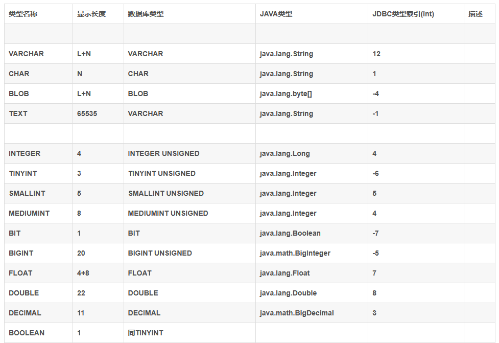

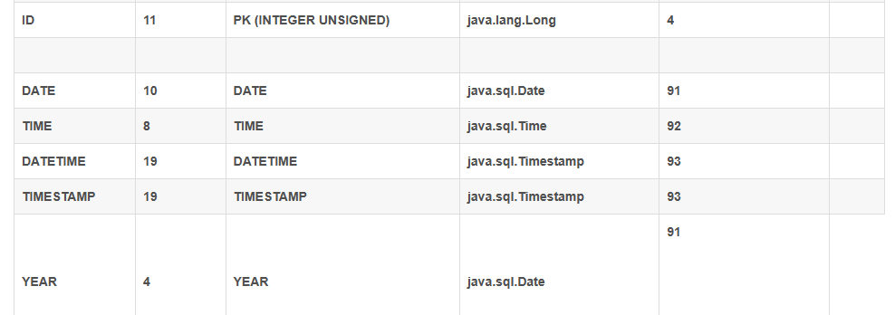

##### Mysql中Bigint与Java数据类型对应关系

- **MySQL中，有符号类型 Bigint(20)**的取值范围 为-9223372036854775808~9223372036854775807，**与Java.lang.Long的取值范围完全一 致，mybatis/mybatis-plus会将 Bigint(20)映射为Long类型**。 
- **MySQL中，无符号类型Bigint(20) unsigned**的取值范围是0 ~ 18446744073709551615， **其中有一半的数据超出了Java中Long类型的取值范围，mybatis/mybatis-plus会将 Bigint(20) unsigned映射为BigInteger类型**。
-  MySQL中有符号int类型最大可以支持到约22亿，这个范围远远超过了我们实际项目中的需求和 MySQL单表所能支持的性能上限。对于OLTP应用来说，单表的数据规模一般控制在千万级 别，单表数据量不会达到亿的级别（Mysql单表性能问题要考虑在内）。 Mysql中无符号int类型，上限为42亿，预留量非常充足

##### 8、插入数据的时候，报错 Incorrect string value: '\xF0\x9F\x98\xAD",...'

彻底解决：`Incorrect string value: '\xF0\x9F\x98\xAD",...' for column 'commentContent' at row 1`。这个是因为字符的编码不对

https://blog.csdn.net/hzw19920329/article/details/55670782 

##### 9、MySQL 中文字段排序 

```mysql
SELECT * FROM promotions p ORDER BY CONVERT (p.name_t_ch USING gbk) collate gbk_chinese_ci DESC ;
```


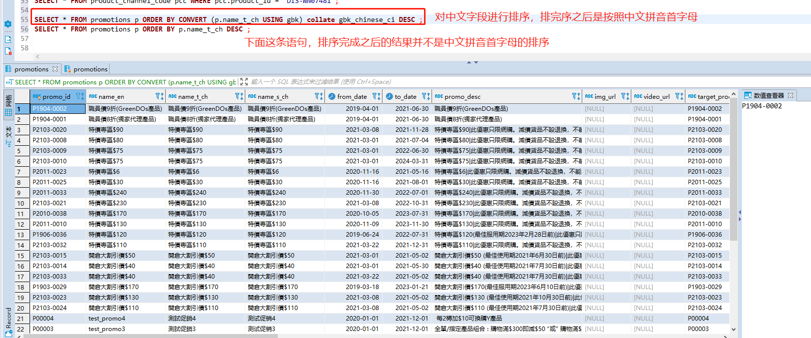

`MySQL`创建数据库的时候，除了数据库名称和字符集之外，还可以设置`Collation`【排序规则】不写的时候使用的默认的排序规则。

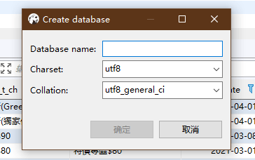

第一个是数据库名，第二个是字符集，第三个是排序规则。例如：

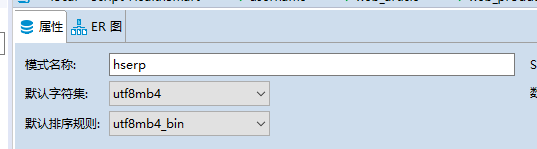  

【规则排序概念】：是指对指定字符集下不同字符的比较规则。排序规则有以下特征。

- 它和字符集（charset）相关
- 每种字符集都有多种它支持的排序规则
- 每种字符集都会默认指定一种排序规则为默认值

排序规则作用：排序规则指定之后，它会影响到我们使用`order by`语句查询的结果顺序，会影响到`where`条件中大于小于号的筛选结果，会影响 `DISTINCT`、`GROUP BY`、`HAVING` 语句的查询结果。另外，mysql 建索引的时候，如果索引列是字符类型，也会影响索引创建，只不过这种影响我们感知不到。总之，**凡是涉及到字符类型比较或排序的地方**，都和排序规则有关。 

 **字符序就是字符的排序和比较规则，一般以 _ci 结尾的表示大小写不敏感，_cs 结尾的表示大小写敏感，_bin 结尾的表示用编码值进行比较。** 

**2.2 排序规则优先级**
优先级顺序是 SQL语句 > 列级别设置 > 表级别设置 > 库级别设置 > 实例级别设置

例如列级别设置字符集和排序规则：

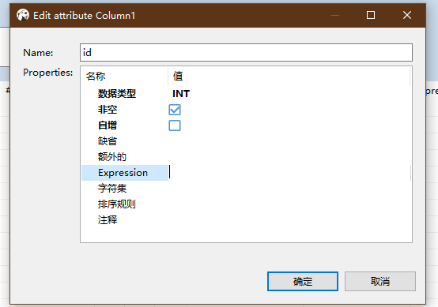

也就是说，如果SQL语句中指定了排序规则，则以其指定为准，否则以下一级为准（也就是列级别），如果列级别没有指定，默认是继承表级别的设置，以此类推。

**3、几种常用排序规则介绍**
我们以字符集utf8mb4为例，常用的排序规则有：utf8mb4_general_ci、utf8mb4_bin、utf8mb4_unicode_ci。

1. **utf8mb4_general_ci**
   **ci即case insensitive**，不区分大小写。没有实现Unicode排序规则，在遇到某些特殊语言或者字符集，排序结果可能不一致，但是，在绝大多数情况下，这些特殊字符的顺序并不需要那么精确。另外，在比较和排序的时候速度更快。
2. **utf8mb4_bin**
   将字符串每个字符用二进制数据编译存储，区分大小写，而且可以存二进制的内容。
3. **utf8mb4_unicode_ci**
   不区分大小写，基于标准的Unicode来排序和比较，能够在各种语言之间精确排序，在特殊情况下，Unicode排序规则为了能够处理特殊字符的情况，实现了略微复杂的排序算法，所以兼容度比较高，但是性能不高。
   ————————————————
   原文链接：[博客](https://blog.csdn.net/leoxyk/article/details/99855608)  

##### 10、mysql随机查询十条记录  

```mysql
SELECT * FROM product p2 order by rand() LIMIT 0, 10;
SELECT id FROM table WHERE id >= FLOOR(RAND() * 1000) LIMIT 10;
```

##### 11、mysql ,700W 数据的表，如何做分页查询，速度低于 1s?

（1）伪需求，一页100条数据，也得7w页，你回去看第6w页的数据嘛。

（2）线上 mysql 数据库 13626210 条数据，select * from Table order by id desc limit 1000, 100; （ id 是主键），查询想超过 1s 很难。select * from Table order by id desc limit 10000000, 100;就会慢了。  

（3）单表 2k 多万，id 是自增，非自增情况，可用雪花算法支持排序，这个我没实际用过，我都是用自增

SELECT * FROM `ht` LIMIT 20049925, 30; // 9.283s
SELECT * FROM `hanting` WHERE id>20049925 LIMIT 30; // 0.001s

前一页的最大行 id，根据 id 来限制起点

（4）加索引就足够快了，通过 id 来翻页，我们单表单库两亿多数据
select max(id) from xxx; 262992300 条
select * from xxx where id > 262991800 limit 10;
通过这种方式来检索 0.041s

##### 12、视图权限不够，导致启动初始化数据库映射时报错   

```mysql
DROP USER 'hserp'@'%'; 
DROP USER 'hserp'@'localhost';
-- CREATE USER <用户名> [ IDENTIFIED ] BY [ PASSWORD ] <口令> 
-- 而没指定主机名，则主机名默认为“%”，表示一组主机。
CREATE USER 'hserp'@'%' IDENTIFIED BY 'fb123';
CREATE USER 'hserp'@'localhost' IDENTIFIED BY 'fb123';

GRANT ALL ON *.* TO 'hserp'@'localhost' WITH GRANT OPTION;
GRANT ALL ON *.* TO 'hserp'@'%' WITH GRANT OPTION;
GRANT RELOAD ON *.* TO 'hserp'@'localhost' WITH GRANT OPTION;
GRANT RELOAD ON *.* TO 'hserp'@'%' WITH GRANT OPTION;
-- 当前使用了 hserp fb123 这个用户连接的数据库
-- 视图查询，product_warehouse_view pwv 这个视图是之前用 root 用户创建的，现在查询报错
SELECT * FROM product_warehouse_view pwv ;

-- SQL 错误 [1449] [HY000]: The user specified as a definer ('root'@'%') does not exist
```

查看这个视图的权限

```mysql
Name                |Value            
--------------------|-----------------
View                |product_warehouse
Create View         |CREATE ALGORITHM=UNDEFINED DEFINER=`root`@`%` SQL SECURITY DEFINER VIEW `product_warehouse_view` AS select `t1`.`product_id` AS `product_id`,`t2`.`all_warehouse_id` AS `all_warehouse_id` from (`etwtp_hs`.`product` `t1` left join (select `etwtp_hs`.`inventory`.`product_id` AS `product_id2`,group_concat(distinct `etwtp_hs`.`inventory`.`warehouse_id` separator ',') AS `all_warehouse_id` from `etwtp_hs`.`inventory` where (`etwtp_hs`.`inventory`.`qty_qoh` > 0) group by `etwtp_hs`.`inventory`.`product_id`) `t2` on((`t1`.`product_id` = `t2`.`product_id2`))) where (`t2`.`all_warehouse_id` is not null)|
character_set_client|utf8             
collation_connection|utf8_general_ci  
```

创建root@%用户

```mysql
CREATE USER 'root'@'%';
ALTER USER 'root'@'%'
IDENTIFIED BY '123456' ;
-- 这些是 DBA 权限
GRANT Create user ON *.* TO 'root'@'%';
GRANT Event ON *.* TO 'root'@'%';
GRANT File ON *.* TO 'root'@'%';
GRANT Process ON *.* TO 'root'@'%';
GRANT Reload ON *.* TO 'root'@'%';
GRANT Replication client ON *.* TO 'root'@'%';
GRANT Replication slave ON *.* TO 'root'@'%';
GRANT Show databases ON *.* TO 'root'@'%';
GRANT Shutdown ON *.* TO 'root'@'%';
GRANT Super ON *.* TO 'root'@'%';
GRANT Create tablespace ON *.* TO 'root'@'%';
GRANT Usage ON *.* TO 'root'@'%';
```

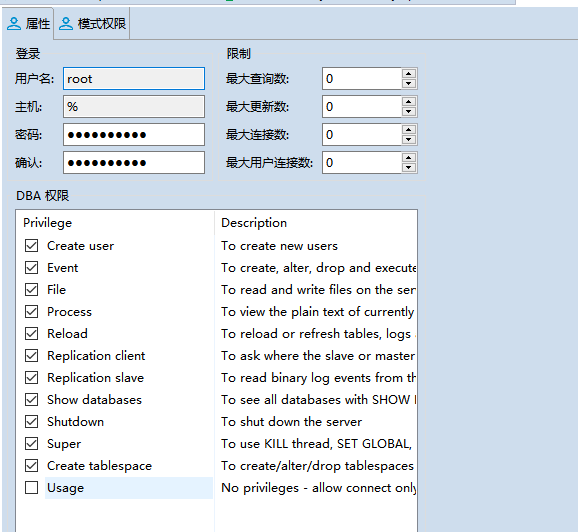

再次查询`SELECT * FROM product_warehouse_view pwv ;`出现错误：

SQL 错误 [1356] [HY000]: View 'etwtp_hs.product_warehouse_view' references invalid table(s) or column(s) or function(s) or definer/invoker of view lack rights to use them

还是权限不够，查看了之后还有一些是没有赋权限的。  

还有表权限和其他权限

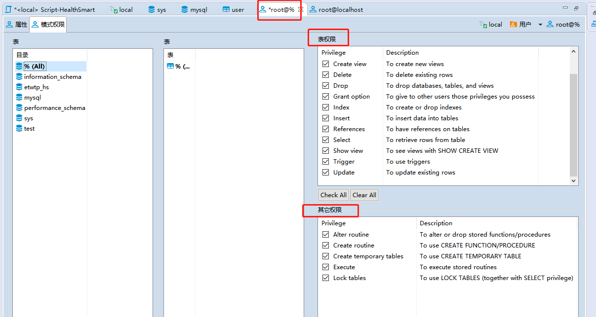

```mysql
GRANT Alter ON *.* TO 'root'@'%';
GRANT Create ON *.* TO 'root'@'%';
GRANT Create view ON *.* TO 'root'@'%';
GRANT Delete ON *.* TO 'root'@'%';
GRANT Drop ON *.* TO 'root'@'%';
GRANT Grant option ON *.* TO 'root'@'%';
GRANT Index ON *.* TO 'root'@'%';
GRANT Insert ON *.* TO 'root'@'%';
GRANT References ON *.* TO 'root'@'%';
GRANT Select ON *.* TO 'root'@'%';
GRANT Show view ON *.* TO 'root'@'%';
GRANT Trigger ON *.* TO 'root'@'%';
GRANT Update ON *.* TO 'root'@'%';
GRANT Alter routine ON *.* TO 'root'@'%';
GRANT Create routine ON *.* TO 'root'@'%';
GRANT Create temporary tables ON *.* TO 'root'@'%';
GRANT Execute ON *.* TO 'root'@'%';
GRANT Lock tables ON *.* TO 'root'@'%';
-- 上面这些赋权限的操作可以用一个语句进行,也就是上面的
GRANT ALL ON *.* TO 'hserp'@'localhost' WITH GRANT OPTION;
GRANT ALL ON *.* TO 'hserp'@'%' WITH GRANT OPTION;
GRANT RELOAD ON *.* TO 'hserp'@'localhost' WITH GRANT OPTION;
GRANT RELOAD ON *.* TO 'hserp'@'%' WITH GRANT OPTION;
```

再进行视图查询就不会报错了

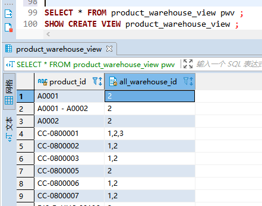

##### 13、条件判断  

MySQL中使用 `select null = null;`查询出来的是 null，并不是一个Boolean值，而

```mysql
SELECT 2 = 2 FROM DUAL;  -- 结果是1，代表 true
SELECT 2 = 1 FROM DUAL; -- 结果是0，代表 false
```

##### 14、SQL查找是否"存在"，别再count了  

```mysql
SELECT count(*) FROM table WHERE a = 1 AND b = 2
int nums = xxDao.countXxxxByXxx(params);  
if ( nums > 0 ) {  
  //当存在时，执行这里的代码  
} else {  
  //当不存在时，执行这里的代码  
}
-- 优化
SELECT 1 FROM table WHERE a = 1 AND b = 2 LIMIT 1  
Integer exist = xxDao.existXxxxByXxx(params);  
if ( exist != NULL ) {  
  //当存在时，执行这里的代码  
} else {  
  //当不存在时，执行这里的代码  
}
```

##### 15 MySQL 返回确切的 UNIX 时间戳函数

###### unix_timestamp()

unix_timestamp()函数的作用是返回一个确切的时间点的UNIX时间戳，这个Unix时间戳是一个无符号整数。 

- unix_timestamp()函数有两种重载形式，一是不带任何参数，另外一个是带有一个Date或DateTime或TimeStamp类型的参数。
- unix_timestamp()，返回自1970-1-1 8:00:00开始到当前系统时间为止的秒数。
- unix_timestamp(date)，返回1970-1-1 8:00:00开始到date所代表的时间为止的秒数，对于早于1970-1-1 8:00:00的时间，总是返回 0 。

```mysql
SELECT CURRENT_TIMESTAMP();
CURRENT_TIMESTAMP()|
-------------------|
2022-11-02 12:14:05|

select unix_timestamp();
unix_timestamp()|
----------------|
      1667362396|

unix_timestamp(CURRENT_TIMESTAMP())|
-----------------------------------|
                         1667362423|
                         
select unix_timestamp('2022-11-02 00:00:00') AS cur;
cur       |
----------|
1667318400|

select unix_timestamp('1970-1-1 6:00:00'); 
unix_timestamp('1970-1-1 6:00:00')|
----------------------------------|
                                 0|
                                 
select unix_timestamp('1970-1-1 8:00:01');
unix_timestamp('1970-1-1 8:00:01')|
----------------------------------|
                                 1|
                                 
select unix_timestamp('1970-1-1 8:01:00');
unix_timestamp('1970-1-1 8:01:00')|
----------------------------------|
                                60|
```

###### from_unixtime()

如果知道了UNIX时间戳，如何换算成其对就的时间呢? 

```mysql
select date_add('1970-01-01 8:00:00',interval 1303191235 second);

date_add('1970-01-01 8:00:00',interval 1303191235 second)|
---------------------------------------------------------|
2011-04-19 13:33:55                                      |

-- 等同于
select from_unixtime(1303191235);
from_unixtime(1303191235)|
-------------------------|
      2011-04-19 13:33:55|
```

##### 16 存储过程和函数

set 语法的文档： https://dev.mysql.com/doc/refman/8.0/en/set-variable.html 

创建存储过程和函数的文档： https://dev.mysql.com/doc/refman/8.0/en/create-procedure.html

函数和存储过程使用博客：https://www.cnblogs.com/shipment/p/15103635.html 

游标使用：https://www.jianshu.com/p/9a0b4c00f491

对于当前有一个需求是这样的：

1. 新建表user_uuid_map，字段：user_id varchar(50)，web_uuid varchar(200)，2个字段都作主键。
2. 对于当前user_home_log存量数据，给其中每个user id按当前web uuid逻辑生成新的uuid(生成时间统一用2022-11-02 00：00：00)。并且生成的数据对应user id存入user_uuid_map表。

```mysql
CREATE TABLE `user_uuid_map` (
  `user_id` varchar(50) COLLATE utf8mb4_bin NOT NULL,
  `web_uuid` varchar(200) COLLATE utf8mb4_bin NOT NULL,
  PRIMARY KEY (`user_id`,`web_uuid`)
) ENGINE=InnoDB DEFAULT CHARSET=utf8mb4 COLLATE=utf8mb4_bin
```

user_home_log 的数据是记录了用户访问了哪个页面：

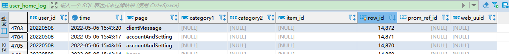

现在要针对每个user_id 生成一个 uuid，生成的 uuid 的规则则是前端定义好的规则，所以需要将规则转为 MySQL 生成，所以就需要定义一个函数：

```mysql
/*删除 generateUuid */ 
DROP FUNCTION IF EXISTS generateUuid;
-- 这步操作一定要做，不然会执行不了，注意函数定义的每个语句后面都需要分号结尾，不然会报错，一定要记住，我就因为这个弄好久。declare 需要在 set 前定义比较好。
/**
 * 1 DROP FUNCTION IF EXISTS generateUuid; 先删除
 * 2 DELIMITER //
 * 3 执行时，选中create 到 end
 * 4 再执行 DELIMITER ;
 */
/* 1 删除函数 generateUuid */
DROP FUNCTION IF EXISTS generateUuid;
/* 2 设置结束符为 // */
DELIMITER //
/* 3 创建 uuid 函数 */
CREATE FUNCTION generateUuid(str varchar(100), timeValue varchar(100))
  RETURNS varchar(3000) DETERMINISTIC
  BEGIN
	DECLARE uuid varchar(3000) DEFAULT '';
	DECLARE i int;
	DECLARE d int;
	SET d = unix_timestamp(timeValue);
 	set @str = str;
 	SET @len = char_length(@str);
 	SET i = 1;
 	WHILE (i <= @len) DO
 		SET @r = (rand() * 16 + d) % 16 | 0;
 		SET d = floor(d / 16);
 		SET @curS = substring(@str, i, 1);
 		SET @needConvert = '';
 		IF @curS = 'x' THEN
 			SET @needConvert = @r;
 			SET uuid = concat(uuid, lower(conv(@needConvert, 10, 36)));
 		ELSEIF @curS = 'y' THEN
 			SET @needConvert = @r & 0x3 | 0x8;
 			SET uuid = concat(uuid, lower(conv(@needConvert, 10, 36)));
 		ELSE
 			SET @needConvert = concat(@needConvert, @curS);
 			SET uuid = concat(uuid, @needConvert);
 		END IF;
 		SET i = i + 1;
 	END WHILE;
 	RETURN uuid;
  END
//
/* 4 设置结束符为 ; */
DELIMITER ;

-- 执行调用则是 
SELECT generateUuid('xxxxxxxx-xxxx-4xxx-yxxx-xxxxxxxxxxxx','2022-11-02 00:00:00');
SELECT lower(hex(10));
SELECT conv("7", 10, 36);
SELECT (rand() * 16 + 1000) % 16 | 0;
SELECT substring('xxxxxxxx-xxxx-4xxx-yxxx-xxxxxxxxxxxx', 1,1); 
```

在定义一个存储过程，使用游标进行操作：可以参考博客： https://www.jianshu.com/p/9a0b4c00f491 

```mysql
/*如果存储过程存在则删除*/ 
DROP PROCEDURE IF EXISTS addUserUuidMapProcedure;
/*设置结束符为 // */ 
DELIMITER // 
/*创建存储过程proc1*/ 
CREATE PROCEDURE addUserUuidMapProcedure()
	BEGIN
		DECLARE user_id_value varchar(50);
		DECLARE flag int DEFAULT 0;
		# 申明一个游标来记录 sql 的查询结果
		DECLARE user_id_list CURSOR FOR SELECT user_id FROM user_home_log GROUP BY user_id ;
		# 建立一个循环退出标志，当游标遍历完后将flag的值设置为1
		DECLARE CONTINUE handler FOR NOT FOUND SET flag = 1;
		# 打开游标
		OPEN user_id_list;
			# 将游标中的值赋给定义好的变量，实现循环
			FETCH user_id_list INTO user_id_value;
			WHILE flag <> 1 do 
				# 获取uuid
				SET @uuid = '';
				SELECT generateUuid('xxxxxxxx-xxxx-4xxx-yxxx-xxxxxxxxxxxx','2022-11-02 00:00:00') INTO @uuid ;
				# 插入一条数据
				INSERT INTO user_uuid_map (`user_id`, `web_uuid`) VALUES (user_id_value, @uuid);
				# 游标往后移
				FETCH user_id_list INTO user_id_value;
			END WHILE ;
		CLOSE user_id_list;
	END //
/*将结束符置为;*/ 
DELIMITER ;
-- 调用
CALL addUserUuidMapProcedure();
-- 查询结果
SELECT * FROM user_uuid_map ;
user_id   |web_uuid                            |
----------|------------------------------------|
20220506  |32ad8cbd-281f-4298-a6b3-fg2c69c37db1|
20220507  |4995274a-866d-47e0-b809-cb2c3ace2f6f|
20220508  |9aed801b-e91c-4f78-8bb5-d7c7e35e784d|
20220509  |5b16g955-7dc4-4159-8e66-a9f16b6cb407|
20220510  |04g49e41-f2d9-4fg3-acc9-0713bcb6a299|
KenixChu  |4e52eca8-7eg5-4e81-98f1-24d7dad4bdda|
MarkMa    |da5e8dg1-142e-467f-ab2c-2c5865b45e8d|
Pat1      |75ea9e43-7e1b-4687-806d-9c0e77df334a|
T001      |7d69fb5g-8a8c-4cf9-b2g9-d6577b2bfa49|
admin     |gc867177-56f8-47ag-aa5d-77b2c3ebd1e1|
andyzhong |d73c93b9-g6df-4919-b63f-c573c269bdf5|
diko003   |b226c5ef-809d-4f9e-9057-3087aggge8f2|
grace01   |fa1a2621-d79a-4e50-bg9e-9d67gcc7f77f|
grace03   |3cb6e3d1-4320-4933-956f-f17252ae7b27|
grace04   |d5bdf3b8-742b-4bb5-acgb-e936445gfa61|
grace67   |1d56gb1d-ce34-41b3-ae24-9d53f59f171e|
grace68   |57c9d582-63be-448d-ad66-1c70df73a8bf|
...
```

##### 18 分页数据错乱重复

https://www.cnblogs.com/glon/p/6806064.html

order by 和 limit 一起使用，当order by字段的值相同时，有可能会出现第一页的数据在第二页又出现的情况。

官网解释：https://dev.mysql.com/doc/refman/8.0/en/limit-optimization.html

> If multiple rows have identical values in the `ORDER BY` columns, the server is free to return those rows in any order, and may do so differently depending on the overall execution plan. In other words, the sort order of those rows is nondeterministic with respect to the nonordered columns.
>
> One factor that affects the execution plan is `LIMIT`, so an `ORDER BY` query with and without `LIMIT` may return rows in different orders. Consider this query, which is sorted by the `category` column but nondeterministic with respect to the `id` and `rating` columns:

如何解决？

order by A，后面再加上一个唯一的字段进行排序。order by A, B，当A值相同时，使用B排序。

##### 19 MySQL 的 NULL 和其他值比较问题

在MySQL中，`NULL`是一个特殊的值，表示缺失或未知的数据。因此，当您执行`SELECT NULL != '12'`时，由于`NULL`与任何其他值的比较都会返回`NULL`，所以该查询的结果也是`NULL`。


#### 二、MySQL 事务相关  

事务概览：

```mysql
-- 插入两条数据
INSERT INTO username(id, name) value (1, "xiaoming");
INSERT INTO username(id, name) value (2, "小黑");
SELECT * FROM username u WHERE u.id = 1;
-- 通过这个查询事务
show variables like '%tx_isolation%';
SELECT @@tx_isolation;
SHOW variables LIKE 'transaction_isolation';
-- 修改事务隔离级别
SET [SESSION | GLOBAL] TRANSACTION ISOLATION LEVEL {READ UNCOMMITTED | READ COMMITTED | REPEATABLE READ | SERIALIZABLE}
UPDATE 
-- 同一个窗口中测试不出来事务，同一个窗口应该是在一个事务中。
/*
 * sql标准的事务隔离级别
 * 读未提交（read uncommitted）：一个事务还没提交时，它做的变更就能被别的事务看到。（读取未提交的数据也被称为脏读）
 * 读提交（read committed）：一个事务提交之后，它做的变更才会被其他事务看到。
 * 可重复读（repeatedable read）：一个事务执行过程中看到的数据，总是跟这个事务在启动时
 * 看到的数据是一致的。当然在可重复读隔离级别下，未提交变更对其他事务也是不可见的。
 * 会导致一个问题（幻读：简单的说，幻读指当用户读取某一范围的数据行时，另一个事务又在该范围内插入了新行，当用户再读取该范围的数据行时，会发现有新的“幻影” 行）
 * 串行化（serializable）：顾名思义是对于同一行记录，“写”会加“写锁”，“读”会加“读锁”。
 * 当出现读写锁冲突的时候，后访问的事物必须等前一个事务执行完成，才能继续执行。
 * */
set session transaction isolation level read uncommitted;
-- 开启事务
begin;
commit;
rollback;

```


#### 三、遇到的一些代码上的错误  

##### （1）`mysql`**数据库安全检查，代码中使用了“不检查的情况”**  

报错信息：

```java
Caused by: com.mysql.jdbc.exceptions.jdbc4.MySQLSyntaxErrorException: Expression #1 of SELECT list is not in GROUP BY clause and contains nonaggregated column 'etwtp.inventoryr0_.inventory_id' which is not functionally dependent on columns in GROUP BY clause; this is incompatible with sql_mode=only_full_group_by
```

或者是使用了不规范的时间格式，但是插入语句很多的时候，可以“设置不检查日期格式”。  

解决方法：设置`mysql`默认的检查为 不检查分组。先使用命令查询`mysql`的`sql_mode`：

```mysql
-- 设置不检查日期模式
SHOW variables LIKE '%mode%'; 
set session sql_mode="ALLOW_INVALID_DATES";

-- 先查询出所有的sql_mode，然后再设置这个值
SELECT @@sql_mode;
-- 关闭mysql的ONLY_FULL_GROUP_BY模式，这个模式是mysql提供的检查
SET SESSION sql_mode='STRICT_TRANS_TABLES,ALLOW_INVALID_DATES,NO_AUTO_CREATE_USER,NO_ENGINE_SUBSTITUTION'.
```

如果还会报错，看下全局的 sql_mode，然后再设置一下全局的 sql_mode，再尝试运行。

```mysql 
SELECT @@global.sql_mode;
SET @@global.sql_mode='STRICT_TRANS_TABLES,NO_ZERO_IN_DATE,NO_ZERO_DATE,ERROR_FOR_DIVISION_BY_ZERO,NO_AUTO_CREATE_USER,NO_ENGINE_SUBSTITUTION';
```

可以参考连接：https://blog.csdn.net/qq_33621326/article/details/95950264 ，设置完之后再使用这样的语句就不会报错了。使用语句，使用的是hibernate：  

```mysql
select t1, t2, t3, sum(t1.qtyQOH), sum(t1.qtyATP) from InventoryRec t1
left join ProductRec t2 on t1.productId = t2.persistentKey.productId
left join WarehouseRec t3 on t1.warehouseId = t3.persistentKey.warehouseId where 1=1
```


