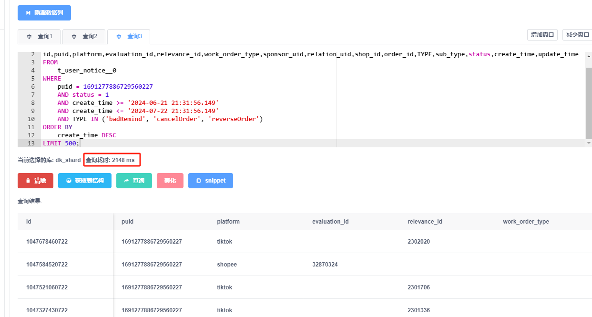

#### 优化1 

##### 建表语句

```mysql
CREATE TABLE t_user_notice__0 ( 
id bigint(20) NOT NULL COMMENT '非自增ID',
puid bigint(20) DEFAULT '0' COMMENT '商户puid',
platform varchar(20) DEFAULT NULL COMMENT '平台',
evaluation_id int(11) DEFAULT NULL COMMENT '评价id',
relevance_id varchar(50) DEFAULT NULL COMMENT '推送关联id',
shop_id varchar(20) DEFAULT NULL COMMENT '店铺id',
order_id varchar(20) DEFAULT NULL COMMENT '订单id',
type varchar(20) DEFAULT NULL COMMENT '通知类型',
work_order_type int(11) DEFAULT NULL COMMENT '工单提醒分类1.分配工单2.评价工单3.回复工单',
sponsor_uid bigint(20) DEFAULT NULL COMMENT '工单通知发起人',
relation_uid varchar(200) DEFAULT NULL COMMENT '工单通知关联人',
status int(11) DEFAULT NULL COMMENT '操作: 已读0, 未读1',
create_time datetime DEFAULT NULL COMMENT '创建时间',
update_time datetime DEFAULT NULL COMMENT '更新时间',
sub_type varchar(50) DEFAULT NULL COMMENT '二级类型',
PRIMARY KEY (id),
KEY idx_puid_shopId_status_createTime (puid,shop_id,status,create_time),
KEY puid (puid),
KEY idx_puid_type_status_shop_id (puid,type,status,shop_id),
KEY idx_puid_rid_sid (puid,relation_uid,shop_id) ) ENGINE = InnoDB DEFAULT CHARSET = utf8 COMMENT = '通知管理信息表';
```

##### 查询语句

```mysql
EXPLAIN 
SELECT
id,puid,platform,evaluation_id,relevance_id,work_order_type,sponsor_uid,relation_uid,shop_id,order_id,TYPE,sub_type,status,create_time,update_time
FROM
	t_user_notice__0
WHERE
	puid = 1691277886729560227
	AND status = 1
	AND create_time >= '2024-06-21 21:31:56.149'
	AND create_time <= '2024-07-22 21:31:56.149'
	AND TYPE IN ('badRemind', 'cancelOrder', 'reverseOrder') 
ORDER BY
	create_time DESC
LIMIT 500;
```

##### 表的总数据量

16分表0-15，实际的这个表的数据1834138。

```mysql
SELECT count(id) FROM t_user_notice__0;
-- 1834138
```

##### sql的执行耗时



##### sql的执行计划

| id   | select_type | table            | partitions | type | possible_keys                                                | key                  | key_len | ref   | rows  | filtered | Extra                                                  |
| ---- | ----------- | ---------------- | ---------- | ---- | ------------------------------------------------------------ | -------------------- | ------- | ----- | ----- | -------- | ------------------------------------------------------ |
| 1    | SIMPLE      | t_user_notice__0 |            | ref  | idx_puid_shopId_status_createTime,puid,idx_puid_type_status_shop_id | **idx_puid_rid_sid** | 9       | const | 38214 | 0.33     | **Using index condition; Using where; Using filesort** |

详细分析：

**type: ref** 表示查询是通过索引的某一部分进行的，效率较高，但不是最佳。

**possible_keys** 列出了查询中可能使用的索引。

**key: idx_puid_rid_sid** 表示查询实际使用了 `idx_puid_rid_sid` 索引。

**key_len: 9** 表示用于索引查询的字节数。由于 `puid` 是 bigint(20)，索引长度为 8 字节，这个字段可以为null，所以长度会加1。

**ref: const** 表示查询条件中使用了常量值（这里是 `puid = 1691277886729560227`）。

**rows: 38214** 表示 MySQL 预估此查询需要扫描 38214 行数据。

**filtered: 0.33** 表示预估过滤后的记录占比，0.33 即 33%。也就是说，MySQL预估大约有12610行数据（38214 * 0.33）满足查询条件并需要进一步处理。

**extra: Using index condition; Using where; Using filesort** 表示查询需要进一步过滤条件（Using where），且需要对结果进行排序（Using filesort）

- Using index condition 使用索引下推。
- Using where 表示MySQL在检索到数据行之后，仍然需要使用 `WHERE` 子句中的条件来过滤数据。尽管使用了索引，MySQL仍需要对符合索引条件的行应用其他的 `WHERE` 条件。
- Using filesort 表示MySQL无法使用索引顺序来满足 `ORDER BY` 子句的要求，而是需要进行文件排序。

##### 优化建议

**创建更合适的复合索引**： 你的查询主要条件为 `puid`、`status`、`create_time` 和 `type`，所以可以尝试创建一个包含这些字段的复合索引，例如

```mysql
CREATE INDEX idx_puid_status_createTime_type ON t_user_notice__0 (puid, status, create_time, type);
```

**调整查询顺序**： 由于 `puid` 和 `status` 的条件已经筛选了大部分数据，可以考虑进一步调整查询条件的顺序，确保在最前面使用过滤效果最好的条件。

###### 执行效果

将线上数据导到本地查看前后对比效果：

**未加索引前**，执行花费0.139s


生产环境执行时间：2333ms，多次执行都几乎要2s左右。


**加了索引后**查看效果，执行耗费时间0.054s，几乎提升了一倍的时间，查看执行计划。

```mysql
CREATE INDEX idx_puid_status_createTime ON t_user_notice__0_online (puid, status, create_time);
```


执行计划，extra只有using where了，


查看执行计划

| id   | select_type | table                   | partitions | type | possible_keys                                                | key                        | key_len | ref         | rows  | filtered | Extra       |
| ---- | ----------- | ----------------------- | ---------- | ---- | ------------------------------------------------------------ | -------------------------- | ------- | ----------- | ----- | -------- | ----------- |
| 1    | SIMPLE      | t_user_notice__0_online |            | ref  | idx_puid_shopId_status_createTime,puid,idx_puid_type_status_shop_id,idx_puid_rid_sid,idx_puid_status_createTime_type,idx_puid_status_createTime | idx_puid_status_createTime | 14      | const,const | 42304 | 0.33     | Using where |

key_len的长度计算：**区分某个使用联合索引的查询具体用了几个索引列**。

> datetime的长度：https://cloud.tencent.com/developer/article/1491131
>
> 官网这么大，怎么搜，想起来目前在用的是MySQL 5.7版本，那就先查查5.7版本的文档吧。
>
> 废话不多说，先把结果拿出来。
>
> 1. v5.6.4版本之前DATETIME占用8字节。
> 2. v5.6.4版本之前TIMESTAMP占用4字节。
> 3. v5.6.4版本开始DATETIME非小数时间部分仅占用5字节，如果有秒的小数部分会占用0-3个字节。
> 4. v5.6.4版本开始TIMESTAMP非小数部分占用4个字节，小数部分占用0-3个字节。
> 5. v5.6.4版本之前DATETIME是分为两部分，分别是4字节的整数存储的；TIMESTAMP是以时间戳整数的形式存储的4字节。
> 6. v5.6.4版本开始，DATETIME的数据结构变化较大，后面详细介绍，TIMESTAMP基本相同只是又小端序改为大端序。
>
> 按官网给出的表格大概是这样的
>
> | Data Types | Before 5.6.4 | As of 5.6.4                          |
> | :--------- | :----------- | :----------------------------------- |
> | DATETIME   | 8 bytes      | 5 bytes + fractional seconds storage |
> | TIMESTAMP  | 4 bytes      | 4 bytes + fractional seconds storage |
>
> 举个例子：比如同样的 DATETIME类型的时间 “2019-07-29 17:30:33” 在v5.6.4之前就是占用8字节，从v5.6.4开始，仅占用 5字节。
>
> 下面的表格是小数部分不同精度所占用的字节数
>
> | Fractional Seconds Precision | Storage Required |
> | :--------------------------- | :--------------- |
> | 0                            | 0 bytes          |
> | 1, 2                         | 1 byte           |
> | 3, 4                         | 2 bytes          |
> | 5, 6                         | 3 bytes          |
>
> 举例：DATETIME(4)，会保存精度为4的时间，会占用5 + 2 = 7bytes，DATETIME(3)与DATETIME(4)，DATETIME(0)与DATETIME一样，只占用5字节。

所以

**`puid`**: 占 8 字节（`bigint`），可以为null，这里会是9

**`status`**: 占 4 字节（`int`），可以为null。这里会是5

**`create_time`**: 占 8 字节（`datetime`），但是我们这里没有小数部分，所以是5个字节。

14看来是9+5=14，看起来是用了这个索引里面的2个索引列。

生产环境加上索引后的执行时间：


