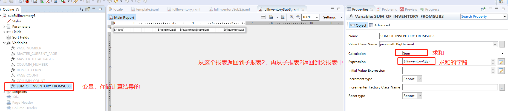

#### 报表使用注意事项

其中一些可以参考博客：[iReport常见和注意的问题](https://blog.csdn.net/xuke6677/article/details/38445339) 

##### 1. Excel报表导出属性设置及导出注意事项  

设置导出时候的一些相关属性配置，具体的一些在源码中，源码如图：


```xml
<!-- 每页一个sheet -->
<property name="net.sf.jasperreports.export.xls.one.page.per.sheet" value="false"/>
<!--导出时候的背景色，不设置，默认是白色，导出excel的时候就是白色的背景色了-->
<property name="net.sf.jasperreports.export.xls.white.page.background" value="false"/>
<!--修改xls表格sheet的名字-->
<property name="net.sf.jasperreports.export.xls.sheet.names" value="invoice summary for successful payment only"/>
<!--删除两行之间的空行-->
<property name="net.sf.jasperreports.export.xls.remove.empty.space.between.rows" value="true"/>
<!--删除两列之间的空行-->
<property name="net.sf.jasperreports.export.xls.remove.empty.space.between.columns" value="true"/>
<!--是否包装text-->
<property name="net.sf.jasperreports.wrap.text" value="false"/>
<!--设置充满单元格-->
<property name="net.sf.jasperreports.print.keep.full.text" value="true"/>  
<property name="com.jaspersoft.studio.report.description" value="invoice summary for successful payment only"/>
```

上面的一些设置也可以通过在代码里面进行设置：

```java
ByteArrayOutputStream pdfOut = new ByteArrayOutputStream();
        try {
            JRXlsExporter exporter = new JRXlsExporter();
            exporter.setExporterInput(new SimpleExporterInput(print));
            exporter.setExporterOutput(new SimpleOutputStreamExporterOutput(pdfOut));
            // do not set the default white background and remove the empty between the rows and the empty between the columns
            AbstractXlsReportConfiguration xlsReportConfiguration = new AbstractXlsReportConfiguration();
            xlsReportConfiguration.setWhitePageBackground(Boolean.FALSE);
            xlsReportConfiguration.setRemoveEmptySpaceBetweenColumns(Boolean.TRUE);
            xlsReportConfiguration.setRemoveEmptySpaceBetweenRows(Boolean.TRUE);
            xlsReportConfiguration.setDetectCellType(Boolean.TRUE);
            // FULL_TEXT
            xlsReportConfiguration.setShrinkToFit(Boolean.FALSE); // 设置字体自动伸缩
            xlsReportConfiguration.setWrapText(Boolean.TRUE); // 设置是否换行
            xlsReportConfiguration.setIgnoreCellBorder(Boolean.FALSE);
            xlsReportConfiguration.setFreezeRow(2); // 冻结至多少行
            xlsReportConfiguration.setFreezeColumn("C"); // 冻结至多少列，之前的会被冻结

            exporter.setConfiguration(xlsReportConfiguration);
            exporter.exportReport();
        } catch (JRException e) {
            logger.error("could not export ReportToXLSStream.", e);
            IOUtils.closeQuietly(pdfOut);
            throw new RuntimeException(e);
        }
        InputStream pdfInputStream = new ByteArrayInputStream(pdfOut.toByteArray());
        response.setReportInputStream(pdfInputStream);
```

可以对单独的一个组件，例如：textField 进行设置属性：

```xml
<textField evaluationTime="Group" evaluationGroup="productGroup" isBlankWhenNull="true">
					<reportElement x="0" y="0" width="80" height="15" uuid="4c9dec3a-58b7-457d-9812-351b61d3212d">
						<property name="com.jaspersoft.studio.spreadsheet.connectionID" value="cedc4d6f-d090-4ec4-9ec0-bb29d16ad0b6"/>
                        <!--设置这个textField的一些属性，界面上也可以进设置-->
						<property name="net.sf.jasperreports.print.keep.full.text" value="true"/>
					</reportElement>
					<textElement verticalAlignment="Middle">
						<font fontName="ARIALUNI"/>
					</textElement>
					<textFieldExpression><![CDATA[$F{productId}]]></textFieldExpression>
				</textField>
```

##### 2.当detail没有数据的时候，使用对应的字段进行加减操作的时候   

定义一个变量：`SUM_OF_QTY`，表达式为下图：


再另外定义一个变量，`SUM_OF_ALL_QTY`, `expression`为`$V{SUM_OF_QTY}.add($P{OPENING_QTY})`，如果是这样操作的话，当detail没有数据的时候，`SUM_OF_QTY`对qty求和则会无效。

##### 3.运行报错 ：`Caused by: java.io.StreamCorruptedException: invalid stream header: 3C3F786D`问题。 

当出现这类问题的时候，基本上都是报表中字段或者其他地方设计有问题，字段不存在，或者字段不匹配，使用了没有定义的字段之类的，详细检查设计基本上都能找到相关的问题。

这个问题被检测到是在编译完成之后对`JasperDesign`进行验证的时候。具体位置是在这个类`JRAbstractCompiler`，代码是：

```java
@Override
public final JasperReport compileReport(JasperDesign jasperDesign) throws JRException
{
    // check if the language is supported by the compiler
    checkLanguage(jasperDesign.getLanguage());

    // collect all report expressions
    JRExpressionCollector expressionCollector = JRExpressionCollector.collector(jasperReportsContext, jasperDesign);

    // verify the report design
    verifyDesign(jasperDesign, expressionCollector);

    String nameSuffix = createNameSuffix();

    // check if saving source files is required
    boolean isKeepJavaFile = JRPropertiesUtil.getInstance(jasperReportsContext).getBooleanProperty(JRCompiler.COMPILER_KEEP_JAVA_FILE);
    File tempDirFile = null;
    if (isKeepJavaFile || needsSourceFiles)
    {
        String tempDirStr = JRPropertiesUtil.getInstance(jasperReportsContext).getProperty(JRCompiler.COMPILER_TEMP_DIR);

        tempDirFile = new File(tempDirStr);
        if (!tempDirFile.exists() || !tempDirFile.isDirectory())
        {
            throw 
                new JRException(
                EXCEPTION_MESSAGE_KEY_TEMP_DIR_NOT_FOUND,
                new Object[]{tempDirStr});
        }
    }
    ...
}
// verifyDesign(jasperDesign, expressionCollector);
private void verifyDesign(JasperDesign jasperDesign, JRExpressionCollector expressionCollector) throws JRException
{
    Collection<JRValidationFault> brokenRules = JRVerifier.verifyDesign(jasperReportsContext, jasperDesign, expressionCollector);
    if (brokenRules != null && brokenRules.size() > 0)
    {
        throw new JRValidationException(brokenRules);
    }
}
```

仔细检查是否有一些不存在字段被使用了，我出现这个问题的原因就是这个原因。最后面调试出来了这个错误信息。错误信息就是在这边提示出来的。   


##### 4. 导出excel报表时，有分组的时候，分组中的textfield中数据显示不全 

现象：分组中显示这个textfield的时候数据只显示一部分，但是在detail中显示同样的字段却能够显示完全。

原因：目前还不知道具体的原因。

暂定解决方法：加宽textfield的宽度为原来的一倍。


##### 5.可以使用`resourceBundle`来进行报表中相关数据的配置。   

 （1）先到工具`Jaspersoft studio`中报表模板的同级创建一个 `ResourceBundle`选择需要创建的几种类型，中文，英文，台湾等


（2）创建完成之后的效果，在其中输入所需要的key即可，然后再报表中引用。


如何在报表中使用这个”资源束“呢？

在设计报表的窗口中，报表的属性有一些是内置的属性，我们使用的时候可以在Java代码中直接对这些属性进行赋值。


具体的代码如下：

```java
    private Map<String, Object> getDefaultParameters(JasperReportContext context) {
        String epId = context.getEpId();
		// params 用来设置到报表中
        Map<String, Object> params = new HashMap<>();

        Locale locale = context.getLocale() != null ? context.getLocale() : Locale.ENGLISH;
        ResourceBundle resourceBundle = ResourceBundle.getBundle(context.getLocaleBasePath(), locale);
        params.put(JRParameter.REPORT_LOCALE, locale);
        // 这个就是用来设置资源束的
        params.put(JRParameter.REPORT_RESOURCE_BUNDLE, resourceBundle);

        // set default format here
        params.put(Pattern.COST_PATTERN.name(), "#,##0.####");
        params.put(Pattern.PRICE_PATTERN.name(), "#,##0.###");
        params.put(Pattern.QTY_PATTERN.name(), "#,##0");
        params.put(Pattern.AMT_PATTERN.name(), "#,##0.##");
        params.put(Pattern.DATE_PATTERN.name(), "dd-MMM-yyyy");
        params.put(Pattern.DATE_TIME_PATTERN.name(), "dd-MMM-yyyy HH:mm:ss");

        params.put("companyName", "aaaa");

        return params;
    }
```

然后在编译报表的代码那里将这个map设置进去；

```java
String template = Paths.get(resourcePath, "template.jrxml").toString();
            String localeBasePath = resourcePath.replaceAll("/", ".") + ".locale";

            final JasperReport report =
                JasperCompileManager.compileReport(this.getClass().getClassLoader().getResourceAsStream(template));
            // async way to generate report, as it may require time on getting some necessary data remmtely
            context.setLocaleBasePath(localeBasePath);
// paramMap 即是上面的map
print = JasperFillManager.fillReport(report, paramMap, JRDataSource.class.cast(source));
```

然后在报表中使用的时候，直接使用对应的key即可，如图。


##### 6.字体显示问题  

设置字体为 <font name="ARIALUNI" >，需要导入相关的jar包才行，`font-ARIALUNI-1.1.jar`

##### 7.导出excel的文件格式`xls`、`xlsx`需要的类  

导出xls格式的excel代码：

```java
@Override
    public void export(JasperPrint print) {
        ByteArrayOutputStream pdfOut = new ByteArrayOutputStream();
        try {
            // 使用这个导出器
            JRXlsExporter exporter = new JRXlsExporter();
            exporter.setExporterInput(new SimpleExporterInput(print));
            exporter.setExporterOutput(new SimpleOutputStreamExporterOutput(pdfOut));
            // do not set the default white background and remove the empty between the rows and the empty between the columns
            AbstractXlsReportConfiguration xlsReportConfiguration = new AbstractXlsReportConfiguration();
            xlsReportConfiguration.setWhitePageBackground(Boolean.FALSE);
            xlsReportConfiguration.setRemoveEmptySpaceBetweenColumns(Boolean.TRUE);
            if (removeEmptySpaceBetweenRows) {
                xlsReportConfiguration.setRemoveEmptySpaceBetweenRows(Boolean.TRUE);
            }
            xlsReportConfiguration.setDetectCellType(Boolean.TRUE);
            exporter.setConfiguration(xlsReportConfiguration);
            exporter.exportReport();
        } catch (JRException e) {
            logger.error("could not export ReportToXLSStream.", e);
            IOUtils.closeQuietly(pdfOut);
            throw new RuntimeException(e);
        }
        InputStream pdfInputStream = new ByteArrayInputStream(pdfOut.toByteArray());
        response.setReportInputStream(pdfInputStream);
    }
```

如果是xlsx类型的excel文件则是使用下面这个导出器，其他的不变：

```java
JRXlsxExporter exporter = new JRXlsxExporter();
```

##### 8.`jrxml`中导入Java类 

import 标签需要放在field上面，properties的下面。可以在报表中使用具体的Java类的方法，一般而言都是静态方法，也可以直接new一个类调用实例方法。  

```xml
<property name="com.jaspersoft.studio.data.defaultdataadapter" value="hs-adapter.xml"/>
    <property name="com.jaspersoft.studio.data.sql.tables" value=""/>
<!--导入的Java类-->
    <import value="org.apache.commons.lang3.StringUtils"/>
    <parameter name="ORDER_ID" class="java.lang.String" isForPrompting="false"/>
    <parameter name="PRICE_PATTERN" class="java.lang.String" isForPrompting="false"/>
    <parameter name="QTY_PATTERN" class="java.lang.String" isForPrompting="false"/>
    <parameter name="TRANSLATE_OF_AMOUNT" class="java.lang.String"/>
    <queryString>
        <![CDATA[]]>
    </queryString>
    <field name="USER_NAME" class="java.lang.String"/>
    <field name="WAREHOUSE_NAME_EN" class="java.lang.String"/>
    <field name="MANUFACTURER_FAX" class="java.lang.String"/>


```

调用方法

```xml
            <textField isStretchWithOverflow="true" isBlankWhenNull="true">
                <reportElement stretchType="ContainerBottom" x="10" y="125" width="300" height="30" uuid="f68c05a2-50d5-4a85-8af2-3b168ff2072b">
                    <property name="com.jaspersoft.studio.unit.y" value="px"/>
                    <property name="com.jaspersoft.studio.unit.height" value="px"/>
                </reportElement>
                <textElement textAlignment="Left" verticalAlignment="Top">
                    <font fontName="ARIALUNI" size="9" isBold="false"/>
                </textElement>
                <textFieldExpression><![CDATA[StringUtils.isBlank($F{MANUFACTURER_NAME_EN}) ? "" : $F{MANUFACTURER_NAME_EN}.replaceAll("\\n|%n", " ")]]></textFieldExpression>
            </textField>
```

##### 9.根据条件是否打印数据  

在报表中选中一个元素或者一个band


##### 10.父子报表数据传递注意点  

（1）传递**集合类的数据**到子报表中展示的时候，要注意使用对用connection。


（2）传递“父报表”中的字段到子报表中，作为子报表中的属性的设置

**父报表中的设置**：  


**子报表中的设置**：在上面右边两个红框上面的 Expression表达式是用来表明子报表的位置的，上面的位置是：

> "com/etwealth/mo/server/report/generalInvoiceStmt/invoiceItem.jrxml"


（3）当涉及到需要在子报表中进行相关数据统计的时候，子报表要将计算好的值返回给父报表用来在父报表的中进行展示或者计算。

**父报表中的设置**，自己的报表是：`fullInventory.jrxml`,它的子报表是：`fullInventorySub2.jrxml`


**子报表`fullInventorySub2.jrxml`中的设置**：（可以嵌套多个子报表），这里就是。这个报表中还有一个子报表`fullInventorySub3.jrxml`。最终的返回值是从`fullInventorySub3.jrxml`返回到`fullInventorySub2.jrxml`中，再返回到`fullInventory.jrxml`中。


继续查看子报表3中的设置；



总的来说，就是从子报表中计算出的结果要存储到子报表中所定义的变量中，然后再到父报表中定义一个变量用来接收这个子报表中计算出的结果值，类型要一致。再通过`SubReport`中的`Return value`进行子报表的到父报表传值的设置，可以再弹窗的设定中设置相应的计算类别。

父子报表可以嵌套多层，每层都是如此，子->父，层层往上。  

##### 11 设计excel模板的坑

（1）当导出的模式为excel的时候，要行对齐，列对齐。不然会出现多出行和多出列的情况。  


##### 12  `detail`的band，显示出来的字段出现了文字重叠    


报表里的文字重叠，需要在重叠的上下字段分隔，将上半部分和下半部分写在两个band 里才行。或者是**加宽加高这个字段的TextField**。 


##### 13 xls 导出参数

https://community.jaspersoft.com/wiki/xls-export-parameters-jasperreports-server


##### 14 Maven无法下载2.1.7.js7版本的itext依赖

[(2条消息) Maven无法下载2.1.7.js7版本的itext依赖_不积跬步，无以至千里-CSDN博客_itext2.1.7 maven](https://lewky.blog.csdn.net/article/details/109322686) 


[**DynamicJasper**](http://dynamicjasper.com/) 依赖版本过高：

因为添加了一个依赖，`"ar.com.fdvs" % "DynamicJasper" % "5.3.0"`  这个版本所需要的  `net.sf.jasperreports jasperreports 6.11.0` 是这个版本，而项目里的版本是 6.7.0。查看官网后，需要将 

`ar.com.fdvs` 版本修改成 5.2.0：


##### 15 报表的一些根据源代码的例子

[Add expression in text field using dynamic jasper (jellyfishtechnologies.com)](https://www.jellyfishtechnologies.com/blog/add-expression-text-field-using-dynamic-jasper/) 用代码添加字段和设计报表

[Building Dynamic Columns in JasperReports - Solution Design Group](https://solutiondesign.com/insights/building-dynamic-columns-in-jasperreports/) 


http://jasperreports.sourceforge.net/sample.reference/printservice/index.html